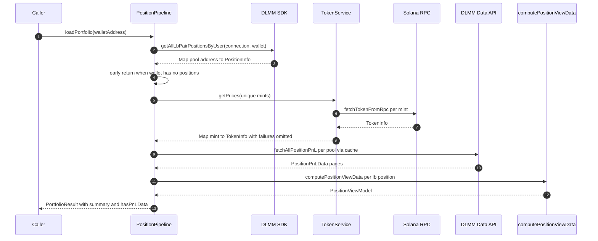

# Position Data Pipeline

The `PositionPipeline` (`src/services/positionPipeline.ts`) is the single
production path that turns a wallet address into everything the positions UI
needs: resolved positions with display-ready view models, token metadata and
live prices, best-effort PnL from the Meteora DLMM Data API, and an aggregated
portfolio summary. It is deliberately layered so that every stage can fail
without losing the stage before it — positions still render when prices or PnL
are unavailable — and so that tests can run the whole flow without an RPC
endpoint.

The pipeline composes four collaborators, each independently testable:

- `createDataServices` (`src/services/data.ts`) — the cached **Data services**
  facade (token prices, display-only OHLCV).
- `computePositionViewData` (`src/utils/positions/computePositionViewData.ts`)
  — a pure raw-data → `PositionViewModel` transform.
- `computePoolPnLSummary` / `findPositionPnL`
  (`src/utils/positions/pnlAggregation.ts`) — pure PnL aggregation and lookup.
- `dlmmApi` (`src/services/dlmmApi.ts`) — the owned, typed client for the DLMM
  Data API (`/positions/{pool}/pnl`, `/portfolio/open`).

## Who calls the pipeline

| Consumer | Entry point | How it uses the pipeline |
| --- | --- | --- |
| Positions screen | `usePositionsPage` (`src/hooks/usePositionsPage.ts`) | `loadPortfolio` on wallet change; refresh is throttled to one call per 30 s and a silent variant re-runs it every 60 s while the app is foregrounded |
| Position widget | `syncPositionWidgets` (`src/widgets/syncPositionWidgets.tsx`) | `loadPortfolio` raced against a 20 s timeout, then persisted as a display-only `PositionWidgetData` snapshot (MMKV) |
| Background task | `widgetBackgroundSync` (`src/tasks/widgetBackgroundSync.ts`) | Every ≥30 min, re-runs the widget sync and reuses a pipeline instance to detect out-of-range transitions from `vm.inRange` for notifications |
| Portfolio summary widget | `syncPortfolioWidget` → `updatePortfolioWidget.fetchPortfolioSummary` | **Does not use the pipeline** — it reads server totals via `dlmmApi.fetchOpenPortfolioSummary` (ADR 0002; see [Dual summary paths](#dual-summary-paths)) |

Dev mock mode (`env.devMock`, forced on web) bypasses the pipeline entirely:
`usePositionsPage` returns a static portfolio from `src/services/mockPortfolio.ts`
shaped exactly like a real `PortfolioResult`.

## `loadPortfolio`: the five steps



*The five steps of `PositionPipeline.loadPortfolio` and the data sources behind each one.*

1. **On-chain scan.** `DLMM.getAllLbPairPositionsByUser(connection, wallet)`
   returns a `Map` of pair address → `PositionInfo`. An empty wallet
   short-circuits: empty `positions`, `summary: null`, `hasPnLData: false`.
2. **Token prices.** Unique mints are collected from every position and fetched
   in one batch through `dataServices.tokens.getPrices` (best-effort — see
   below).
3. **Per-pool PnL.** `fetchAllPnL` fetches PnL for each pool the wallet
   participates in — requesting only `status: 'open'` positions — through the
   cache, with per-pool failure isolation.
4. **View models.** `resolvePositions` flattens the map into one
   `ResolvedPosition` per `lbPairPositionsData` entry — a pair holds many
   positions, so position count can exceed pool count — calling the pure
   `computePositionViewData` for each with the matched `PositionPnLData`
   (`findPositionPnL` by position address, `null` when absent).
5. **Summary.** `computeSummary` rolls every fetched `PositionPnLData` row into
   a `PortfolioSummaryData` (a `PoolPnLSummary` plus `positionCount`), and
   `outOfRangeCount` counts resolved positions whose `vm.inRange` is false.

## Error degradation: positions always render

The pipeline's core contract is that missing auxiliary data degrades the
*numbers*, never the list.

**Token prices — missing `TokenInfo` tolerates `null`.**
`TokenService.getPrices` batch-fetches mints with `Promise.allSettled` and
omits any mint whose `fetchTokenFromRpc` call rejects. The pipeline then looks
mints up with `tokenData.get(mint) ?? null`. When `tokenXInfo`/`tokenYInfo`
are `null`, `computePositionViewData` falls back to `$0.00` for value fields,
`"-"` for fee display strings, and `liquidityShape: null` — the card still
renders (symbols degrade to a truncated mint address in widget data).

**PnL — best-effort per pool.**
`fetchAllPnL` maps each pool onto a task wrapped in `Promise.allSettled`, and
each task has its own `try/catch`: one failing pool neither blocks the others
nor rejects the pipeline. `fetchPortfolioSummary` returns partial data in that
case — e.g. `positionCount: 2` with numbers from the one pool that succeeded.

**`hasPnLData` — all-or-nothing for the summary.**
`computeSummary` returns `summary: null` and `hasPnLData: false` when *no*
pool produced PnL rows (all fetches failed, or the wallet simply has no PnL
data). The positions array is unaffected: every position returns with
`vm.pnlSol = null` and `vm.pnlSolPctChange = null`. A later retry that succeeds
flips the summary back on, because the failed fetch was never cached (see
[Caching](#caching-behavior)). The positions screen treats `hasPnLData` as the
signal for whether the summary header shows real numbers.

## Net cost basis: deposits − withdrawals

`computePoolPnLSummary` defines `totalInitialDepositSol` per position as
**gross deposits − gross withdrawals**:

```text
posInitialDeposit =
  parseFloat(allTimeDeposits.total.sol) - parseFloat(allTimeWithdrawals.total.sol)
```

Gross deposits alone are wrong as a cost basis because they **double-count
redeposits after a withdrawal**: deposit 4.5 SOL, withdraw it, deposit 4.5 again
→ gross deposits read 9.0 while the real committed basis is 4.5. Subtracting
withdrawals (principal `RemoveLiquidity` events) repairs this. Claimed fees
are tracked separately under `allTimeFees`, so the subtraction does not
double-subtract the fee line.

When a position has **no deposit SOL data at all**
(`allTimeDeposits.total.sol` is null/zero), the basis falls back to
**value − uPnL** (`posValueSol - posPnlSol`) — a derived net basis from the
same server snapshot. The same fallback semantic appears in the widget's
server-totals path (ADR 0002), which must derive its basis because
`/portfolio/open` only exposes gross per-pool `totalDepositSol`.

The two weighted ratios use the same aggregation:

- `totalPnlPercent` is the |net cost basis|-weighted mean of per-position
  `pnlSolPctChange` (positions with non-positive basis contribute no weight).
- `feesTvl24h` is the position-value-weighted mean of `parseFeePerTvl24h`
  ratios. The API returns a *percentage* (`"1.31"` = 1.31% daily); the parser
  converts it to the internal ratio `0.0131` so display multiplies by 100.
- Per-position value comes from `unrealizedPnl.balancesSol`; when that SOL
  figure is absent, it falls back to `unrealizedPnl.balances / 200` — the raw
  balance divided by an assumed SOL price of ~200 USD, an approximation used
  only where the server provides no SOL figure.

## Naming: `pnlSol` holds uPnL

Despite the name, `vm.pnlSol` and `vm.pnlSolPctChange` (and the same fields on
the `PositionPnLData` wire type) hold **uPnL** — unrealized PnL, current value
minus initial deposit — an upstream naming convention the codebase inherits and
documents in `UBIQUITOUS_LANGUAGE.md` ("`pnlSol` holds uPnL, despite the
name"). Display code always renders it as uPnL (e.g. `formatUPNLDisplaySol`).
Use **uPnL** when referring specifically to the unrealized figure and **PnL**
for the general concept or aggregated amounts. See
`/openwiki/concepts/domain-model.md` for the full term table.

## View model: a pure transform

`computePositionViewData` is a pure function — no store access, no side
effects — mapping `{ positionData, activeId, positionAddress, poolAddress,
tokenXInfo, tokenYInfo, pnlData }` to a `PositionViewModel`:

- `inRange` is `activeId` within `[lowerBinId, upperBinId]`; `false` when
  `positionData` is missing.
- Value and fee USD figures come from raw BigInt token amounts scaled by each
  token's decimals and priced at `price_info.price_per_token` (live spot; see
  below). Missing token info or missing `positionData` yields `$0.00` / `-`.
- `liquidityShape` carries the per-bin chart data (`ChartBinData[]` with
  SOL-normalized amounts and per-bin price) for the in-card chart.
- `parsePnlNumber` normalizes the API's string-or-number `pnlSol` /
  `pnlSolPctChange` wire values to finite numbers, returning `null` for
  missing, blank, or non-finite input — an unavailable value must never become
  zero.

## Dependency-injection seams

`PositionPipeline` takes an optional `PipelineDeps` object, which is what makes
the whole five-step flow testable without an RPC endpoint:

| Seam | Default | Test/alternative |
| --- | --- | --- |
| `cache` | `CacheManager.getInstance()` singleton | `CacheManager.createFresh()` — a private-constructor instance made for tests |
| `connection` | `getSharedConnection()`, resolved **lazily** on first use | Inject a stub; construction must not require an RPC URL (web mock mode has none) |
| `dataServices` | `createDataServices(this.cache)` | Inject fake `TokenService`/`OhlcvService` |

`createPositionPipeline(deps)` is the factory used by all consumers. The
connection's laziness matters operationally: `getSharedConnection` throws a
guidance error when `EXPO_PUBLIC_RPC_URL` is unset, but only when the pipeline
actually scans the chain — never at construction time.

`CacheManager.createFresh()` also gives tests isolation: the pipeline tests
build a fresh cache per test, stub `globalThis.fetch` for the PnL API, and mock
only the DLMM SDK and token fetchers — exercising the real cache, pagination,
and aggregation logic.

## Caching behavior

All caching goes through `CacheManager.getOrFetch` (TTL expiry, in-flight
request deduplication, explicit invalidation) with these keys:

| Key | Producer | TTL |
| --- | --- | --- |
| `pnl:{poolAddress}:{walletAddress}` | `fetchAllPnL` | `CACHE_TTL.UPNL_PER_POSITION` (15 min) |
| `token_data:{mint}` | `TokenService` | `CACHE_TTL.TOKEN_DATA` (60 s) |
| `ohlcv:{pairAddress}:{timeframe}` | `OhlcvService` | `CACHE_TTL.OHLCV` (60 s) |

Two invariants are worth knowing when changing this code:

- **Partial PnL is never cached.** `fetchAllPositionPnL` walks pages (50 per
  page, max 10) and *rejects* — without returning partial data — if pagination
  fails or exceeds the page limit. Since only resolved promises reach the
  cache, a mid-pagination failure leaves no entry, and the next
  `loadPortfolio` retries the pool cleanly (the tests cover a failure on the
  first and on a later page).
- **`invalidateWallet` is suffix-scoped.** It calls
  `cache.invalidatePattern(":{walletAddress}")`, which matches only the PnL
  keys (they end with the wallet). `token_data:*` keys and other wallets' PnL
  entries survive — so wallet switches and pull-to-refresh re-fetch PnL but
  reuse token prices within their 60 s TTL. `usePositionsPage` invokes it on
  wallet change and before every refresh.

## The DLMM Data API client

`src/services/dlmmApi.ts` is the owned transport for the officially documented
DLMM Data API (it replaced the `metcomet` dependency). Its contract:

- **Typed wire types; strings for money.** SOL/USD values arrive as decimal
  strings and are converted to numbers by consumers, never in the transport.
  Legacy variance is tolerated at the view-model boundary instead
  (`pnlSol?: string | number | null`).
- **Explicit errors.** Any network or non-OK HTTP response raises
  `DlmmApiError` (carrying the status, `null` for network failures) — no silent
  nulls. Callers catch and degrade.
- **All-or-nothing pagination.** `fetchAllPositionPnL` and
  `fetchOpenPortfolioSummary` keep fetching while `hasNext` is true and throw
  if the 10-page cap is reached before completion, so no consumer ever sees an
  incomplete result presented as complete.

`fetchOpenPortfolioSummary` additionally rolls up the two fields the server
does not aggregate: `outOfRangeCount` (Σ `positionsOutOfRange.length`) and a
pool-value-weighted `feesTvl24h`. Per ADR 0002 it deliberately does **not**
roll up `totalDepositSol` — that figure is gross and double-counts redeposits
(the same rationale as the net cost basis above).

### Dual summary paths

Two summary numeration paths exist **on purpose**:

- **In-app** (`PortfolioSummaryData`): client-side aggregation via
  `computePoolPnLSummary` — position-value-weighted, net cost basis from
  deposit/withdrawal history with the value − uPnL fallback. The in-app screen
  shares this fetch with the position cards, so aggregation adds no calls.
- **Widget** (`updatePortfolioWidget.fetchPortfolioSummary`): server totals
  from `/portfolio/open` with cross-page rollups; deposited is derived as
  value − uPnL from the same snapshot. This path has **no RPC, SDK, or Helius
  dependency**.

`PositionPipeline.fetchPortfolioSummary` — a widget-friendly subset of
`PortfolioResult` with no per-position view models — predates ADR 0002 and is
no longer the widget's data path; the widget consumes the server totals
directly. The two deposited figures can differ slightly (event history vs
derived basis).

## Pricing policy (ADR 0001)

Every monetary value in the pipeline derives from **live-spot** token prices:
`TokenInfo.price_info.price_per_token` fetched through the Token service (with
SOL priced via the wrapped-SOL mint). The app deliberately does not fetch
historical prices locally for PnL or value computation — the OHLCV service in
`DataServices` exists only for display charts and must never feed PnL or value
logic. Historical-SOL PnL comes from the server's aggregated endpoints.

## Focused tests

- `src/__tests__/services/positionPipeline.test.ts` — the pipeline contract:
  empty wallet, pagination with caching (`page=2` request observed), no
  partial-PnL caching on failure + successful retry, token-price failure
  degradation, string vs number uPnL wire values rendered without a Helius
  key, `invalidateWallet` scoping, and `fetchPortfolioSummary` including the
  partial-pool-failure case.
- `src/__tests__/utils/pnlAggregation.test.ts` — net cost basis regressions:
  deposit → withdraw → redeposit (9.0 gross → 4.5 net), partial withdrawal,
  null withdrawals treated as zero, value − uPnL fallback, multi-position
  aggregation.
- `src/__tests__/utils/computePositionViewData.test.ts` — view-model defaults
  under missing `positionData`/tokens, in-range boundaries, fee value math,
  PnL passthrough and nulls.
- `src/__tests__/services/dlmmApi.test.ts` — URL construction, `DlmmApiError`
  statuses, pagination walk, page-limit rejection, rollups, no partial
  rollups on late-page failure.
- `src/__tests__/services/data.test.ts` — `DataServices` caching, per-mint
  batch isolation, OHLCV keying by pool + timeframe.

## Related pages

- `/openwiki/architecture/state-and-persistence.md` — widget snapshots (MMKV) and wallet store
- `/openwiki/concepts/caching.md` — `CacheManager` semantics in depth
- `/openwiki/concepts/domain-model.md` — PnL/uPnL vocabulary and view-model terms
- `/openwiki/integrations/solana-and-meteora.md` — DLMM SDK and Data API integration surface
- `/openwiki/workflows/positions-screen.md` — how the screen consumes `usePositionsPage`
