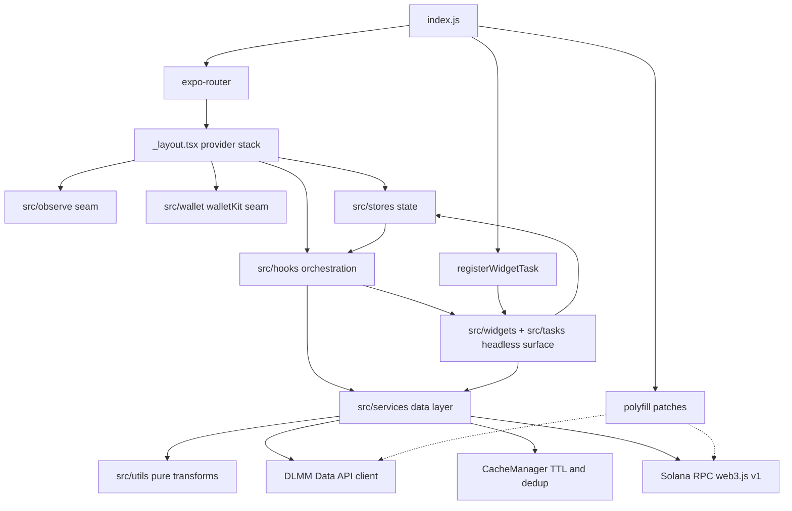

# System Overview

Yonks (`yonksdotsol`) is a React Native (Expo) app for monitoring Meteora DLMM
liquidity positions for a Solana wallet: a positions screen with a PnL summary
and price charts, two Android home-screen widgets, and background out-of-range
alerts. The codebase is bounded into a few layers with strict ownership rules,
wired together by a boot sequence that starts **outside** the React tree.

This page maps the layers and how they bound each other. The position data
path itself is covered in detail by
[Position Data Pipeline](/openwiki/architecture/data-pipeline.md).

## Boot sequence

The app entrypoint `index.js` does exactly three things, in a load-bearing
order:

1. `import './polyfill'` — applies the React Native / Solana compatibility
   patches before any SDK module evaluates. On native this is `polyfill.js`;
   on web Metro resolves `polyfill.web.js` instead.
2. `import 'expo-router/entry'` — hands over to file-based routing, which
   mounts `src/app/_layout.tsx` as the root layout and `src/app/index.tsx` as
   the home screen.
3. `registerWidgetTask()` — registers the Android widget task handler at
   process start, so headless widget clicks (`REFRESH`, `NEXT_POSITION`,
   `PREVIOUS_POSITION`, add/remove) are served even when the app UI never
   mounts.

### The root layout and provider stack

`src/app/_layout.tsx` runs four pieces of setup and then stacks providers:

- **`Observe.configure` at module scope.** The EAS Observe call
  (`integrations: { 'expo-router': true }`) executes when the module is
  imported — before any screen mounts — because toggling it later throws.
  The default export is additionally wrapped in `ObserveRoot.wrap` to measure
  Time to First Render around the root layout. Observe itself is reached only
  through the `src/observe` platform seam (native re-export vs. web no-op).
- **Theme sync.** A `useEffect` mirrors `settingsStore`'s `theme` into
  Uniwind via `Uniwind.setTheme(theme)`, making the persisted store the
  single source of truth for dark/light; neither `set media` nor CSS alone
  can flip the theme.
- **Widget sync.** `useWidgetSync()` mounts the foreground orchestration that
  keeps home-screen widgets fresh on wallet changes, app launch/foreground,
  and a 30-minute interval while active.
- **Provider stack: `GestureHandlerRootView → PixelFontProvider →
MobileWalletProvider → Slot`.** The wallet provider is built once at module
  scope from `createSolanaMainnet({ url: env.rpcUrl || '' })` plus an app
  identity; `PixelFontProvider` publishes the user-selected pixel font from
  `settingsStore` through React context. `MobileWalletProvider` comes from
  the `src/wallet/walletKit` seam, never from the package directly.

The home screen (`src/app/index.tsx`) binds the two orchestration hooks —
`useWalletLifecycle` for connection state and `usePositionsPage` for data —
renders the settings/font/theme affordances, marks EAS Observe interactive
once `walletReady && tokenDataReady`, and renders `PositionsList` inside an
`ObserveErrorBoundary` that turns render-phase errors into a retry screen.

## Two Solana SDKs, one polyfill

Two Solana SDK generations run side by side, per the repository's own
compatibility notes in `AGENTS.md`:

- **`@solana/web3.js` (v1, legacy)** — imported directly by app code: the
  pipeline constructs `PublicKey`s and types against `Connection`, and
  `src/config/connection.ts` builds the shared `Connection`.
- **`@solana/kit` (the v2 SDK)** — reached through
  `@wallet-ui/react-native-kit`'s `MobileWalletProvider`/`useMobileWallet`
  (the kit is that package's RPC/signing engine), which anchors the
  Mobile Wallet Adapter sign-in flow.

Both SDKs, plus Anchor (`@coral-xyz/anchor`, pulled in by `@meteora-ag/dlmm`)
and the DLMM SDK itself, rely on Node.js `Buffer` methods that don't exist on
plain `Uint8Array` under Hermes. All patches live in `polyfill.js`:

- Load order is fixed: `react-native-get-random-values` first,
  quick-crypto `install()` **last**.
- `Buffer.prototype.subarray`/`slice` are patched to return real `Buffer`s
  (`Object.setPrototypeOf`) — this fixes Anchor discriminator extraction.
- ~27 Buffer read/write/copy/fill methods are injected onto
  `Uint8Array.prototype`, forwarding each call through a zero-copy
  `Buffer` view — this fixes `buffer-layout` deserialization.
- `Uint8Array.prototype.equals` is implemented for Anchor's discriminator
  comparisons.

Because `polyfill.js` is imported before `expo-router/entry`, every SDK
module (which Metro evaluates later, as the router's imports fan out) sees
the patched globals. Never fork an SDK or reorder these imports to fix an
SDK error — add the missing method to the polyfill instead.

## Layer ownership and boundaries

The `src/` tree is organized by responsibility, not by technical layer cake:

| Location                      | Owns                                                                                                                                                                                                                                             | Must not contain                                            |
| ----------------------------- | ------------------------------------------------------------------------------------------------------------------------------------------------------------------------------------------------------------------------------------------------ | ----------------------------------------------------------- |
| `src/services/`               | The data layer: everything crossing the network/SDK boundary — `positionPipeline` (on-chain scan → view models → summary), `dlmmApi` (owned DLMM Data API client), `data.ts` (cached token/OHLCV facade), `ohlcv`/`solPrice` fetchers, dev mocks | React state, UI concerns                                    |
| `src/hooks/`                  | Orchestration: React coordination between UI and services (`usePositionsPage`, `useWalletLifecycle`, `useWidgetSync`, `usePoolOhlcv`) plus presentation providers (`useFontConfig`, `useThemeTokens`)                                            | Fetch logic of its own — it schedules and delegates         |
| `src/stores/`                 | State: `settingsStore` (Zustand + persist), `walletStore` and `alertStore` (plain MMKV modules)                                                                                                                                                  | Business computation                                        |
| `src/widgets/` + `src/tasks/` | The headless Android surface: widget rendering, snapshot persistence, and the background-fetch task                                                                                                                                              | Direct RPC plumbing (it consumes the pipeline / API client) |
| `src/utils/`                  | Pure logic: `positions/` (view model, PnL aggregation, formatters, downsampling) and `alerts/` (pure detection + one thin notification sender)                                                                                                   | Store access, fetching, React                               |
| `src/app/`, `src/components/` | Routing and UI                                                                                                                                                                                                                                   | Data plumbing                                               |
| `src/config/`                 | `env`, the shared `Connection`, cache TTLs, theme tokens, fonts                                                                                                                                                                                  | Feature logic                                               |
| `src/observe/`, `src/wallet/` | Platform seams around native-only packages                                                                                                                                                                                                       | —                                                           |

The boundaries are enforced by shape: `utils/` modules take plain inputs and
return plain outputs (testable without mocks), `services/` modules accept
injected dependencies (`CacheManager`, `Connection`, `DataServices`), and
only `hooks/` touch React lifecycle.

_Layer map: boot runs outside React; the shell wires seams, state, and
orchestration; both the UI and the headless surface delegate to the data
layer, which is the only place that talks to RPC or the DLMM Data API; the
polyfill patches underpin both SDK transports._

## Runtime flow across layers

**Foreground (app) flow.** `index.tsx` calls `useWalletLifecycle`, which
resolves the Mobile Wallet Adapter state (address or a 500 ms timeout) and
persists the address to MMKV. `usePositionsPage(walletAddress, walletReady)`
owns the page lifecycle: on wallet change it invalidates the old wallet's
cache via `pipeline.invalidateWallet`, resets loading state, and calls
`PositionPipeline.loadPortfolio`. Refreshes are throttled to one per 30 s,
a silent auto-refresh runs every 60 s while the app is foregrounded and
active, and `tokenDataReady` gates the list against a blank first frame. In
dev mock mode the hook bypasses the pipeline entirely and returns a static
portfolio shaped exactly like a real `PortfolioResult`.

**Headless (widget/background) flow.** The registered widget task handler
routes per-widget actions to `syncPortfolioWidget`/`syncPositionWidgets`;
`syncWidgets` fans out to both. Widget sync reads the wallet snapshot from
MMKV (no React), runs the pipeline (position widget) or the server-totals
API client (portfolio widget, per ADR 0002), persists display-only
snapshots, and renders through `renderWidgets` — re-checking a persisted
request id plus wallet identity before every draw. The expo-background-fetch
task `widget-background-sync` (≥30 min, `startOnBoot`) repeats the widget
sync and then, if alerts are enabled, detects in-range → out-of-range
transitions and schedules local notifications.

## State and persistence map

Persistent state lives in five separate MMKV instances, each owned by one
layer:

| MMKV id           | Owner                             | Contents                                               |
| ----------------- | --------------------------------- | ------------------------------------------------------ |
| `settings`        | `settingsStore` (Zustand persist) | theme, pixel font, alerts enabled, display currency    |
| `wallet`          | `walletStore`                     | wallet address + revision counter                      |
| `alerts`          | `alertStore`                      | per-wallet in-range snapshots for transition detection |
| `widget`          | `syncPortfolioWidget`             | last portfolio summary, latest request id              |
| `position-widget` | `syncPositionWidgets`             | position snapshots, per-widget selection, request ids  |

In-process state lives in the `CacheManager` singleton (TTL cache + in-flight
dedup) shared by the token/OHLCV services, the pipeline's PnL fetch, and
SOL price lookups; it is deliberately not persisted. Only `settingsStore`
is a Zustand store — `walletStore` and `alertStore` are plain module
functions over MMKV so headless tasks can read and write them without
mounting React.

Two ordering invariants protect this map:

- `walletStore.setStoredWalletAddress` **bumps the revision before writing
  the address**, so MMKV value-changed listeners always observe a complete
  `{address, revision}` transition. Widget sync keys request ownership on
  that snapshot pair and discards results from any other wallet session.
- Snapshots are validated on read: a cached summary or position list whose
  embedded wallet snapshot doesn't match the current one — or that fails to
  parse — is removed, never shown for another wallet.

## Platform seams and dev mock mode

Native-only integrations hide behind platform-split modules; Metro loads the
`.web.*` sibling only on web, and both sides must keep their export pairs in
sync:

| Seam                     | Native                                       | Web                             |
| ------------------------ | -------------------------------------------- | ------------------------------- |
| Polyfills                | `polyfill.js`                                | `polyfill.web.js` (Buffer only) |
| Wallet kit               | `src/wallet/walletKit.tsx`                   | stub — no Mobile Wallet Adapter |
| Widget sync hook         | `src/hooks/useWidgetSync.ts`                 | no-op                           |
| Widget task registration | `src/widgets/registerWidgetTask.ts`          | no-op                           |
| Observe                  | `src/observe/index.ts` (real `expo-observe`) | no-op stubs                     |

`src/config/env.ts` sets `devMock` when `EXPO_PUBLIC_DEV_MOCK=1` **or when
`Platform.OS === 'web'`** — the web target exists purely as a mock-data
visual preview with no wallet adapter and no RPC (`mockPortfolio`,
`mockOhlcv`). Every mock bypass short-circuits before any SDK call, which is
also why the pipeline resolves its `Connection` lazily (see below).

## Invariants and failure semantics

- **Polyfill order is load-bearing.** `react-native-get-random-values` must
  load first; quick-crypto `install()` must run last (after the Buffer
  patches are in place).
- **Construction must not require an RPC URL.** The pipeline stores an
  optional injected connection and resolves `getSharedConnection()` lazily
  on first chain access; `getSharedConnection` throws a guidance error when
  `EXPO_PUBLIC_RPC_URL` is unset — only when data is actually fetched, never
  at import or construction time. This is what lets web mock mode (no RPC
  URL) boot the full module graph.
- **Missing auxiliary data degrades numbers, never the list.** Token prices
  and per-pool PnL are best-effort; positions render with `null` PnL and
  `$0.00`/`-` placeholders, and `hasPnLData` flips the summary header.
- **Partial PnL is never cached.** The DLMM API client rejects (all-or-
  nothing pagination) rather than returning incomplete pages, so only
  complete results ever enter `CacheManager`.
- **Superseded headless work never draws.** Every widget render re-checks
  the persisted request id and wallet snapshot at the draw boundary; stale
  runs finish for their original callers but cannot touch the screen.
- **Alert failures can't break the background task.** Notification errors
  are swallowed inside the task's alert block; the task's own result code
  reflects only the widget sync outcome.

## Configuration and operations

- Environment variables (prefix `EXPO_PUBLIC_`, read only through
  `src/config/env.ts`): `EXPO_PUBLIC_RPC_URL` (Solana RPC; required for any
  on-chain fetch), `EXPO_PUBLIC_HELIUS_API_KEY`, `EXPO_PUBLIC_DEV_MOCK`.
- Metro is wrapped by `withUniwindConfig` (`metro.config.js`) with
  `cssEntryFile: './src/global.css'`; Uniwind classes compile from the same
  theme source of truth as the imperative tokens in `src/config/theme.ts`.
- Cache TTLs (`src/config/cache.ts`): PnL 15 min, token data 60 s, OHLCV 60 s.
- Test commands: `bun run test` (Vitest, one pass), type check via
  `tsgo --noEmit` (never `tsc`); full CI is `bun run ci`.

## Focused tests that matter here

- `src/__tests__/stores/CacheManager.test.ts` — TTL expiry, dedup, and
  invalidation semantics of the layer-wide cache.
- `src/__tests__/services/positionPipeline.test.ts` — the pipeline contract
  end to end: mocks only the DLMM SDK, token fetchers, and `fetch` transport
  while exercising the real `CacheManager` and DLMM API client pagination.
- `src/__tests__/widgets/portfolioWidgetSync.test.tsx` /
  `positionLiquidityWidget.test.tsx` — request-ordering and wallet-session
  discard rules for the headless surface.
- `src/__tests__/utils/outOfRange.test.ts` — first-check records state
  without alerting; only in-range → out-of-range transitions alert.
- `src/__tests__/stores/settingsStore.test.ts` and
  `src/__tests__/config/theme.test.ts` — persisted settings and theme token
  integrity behind the root layout's theme sync.

Vitest runs in a node environment with React Native core modules mocked in
`src/__tests__/setup.ts`, and aliases `expo-observe` to the web no-op stub so
any module in the graph stays importable in tests.

## Related pages

- `/openwiki/architecture/data-pipeline.md` — the `PositionPipeline` and its
  error degradation contract
- `/openwiki/architecture/state-and-persistence.md` — MMKV stores and widget
  snapshots in depth
- `/openwiki/concepts/platform-seams.md` — the platform-split module pairs
- `/openwiki/workflows/app-boot-and-wallet.md` — the boot and wallet-connect
  walkthrough
- `/openwiki/workflows/widget-sync.md` — the widget sync flows
  et-connect
  walkthrough
- `/openwiki/workflows/widget-sync.md` — the widget sync flows
