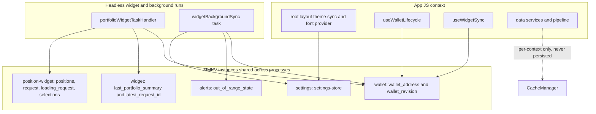
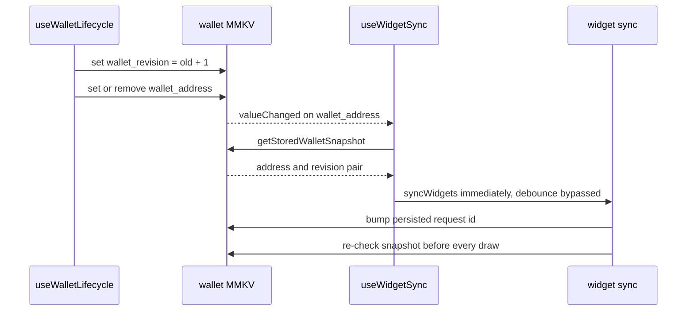

# State & Persistence

Yonks keeps state in two deliberately separate tiers:

- **MMKV persistence** — five small, per-domain instances on disk, readable and
  writable from *any* JS context. This is the only medium shared between the
  app process and headless widget/background runs, so it carries everything a
  headless run needs: the active wallet, alert state, and widget snapshots.
- **In-memory caching** — the `CacheManager` singleton, a `Map` with TTL and
  request deduplication that lives and dies with one JS context. It is never
  persisted and never crosses a process boundary.

Only `settingsStore` is a Zustand store. `walletStore`, `alertStore`, and the
two widget stores are plain module functions over MMKV precisely so headless
tasks can read and write them without mounting React (see the
[System Overview](/openwiki/architecture/overview.md)).

## The MMKV instance inventory

Each `createMMKV({ id })` call happens at module scope in exactly one owning
module, so importing the owner opens the instance. The five ids and their
contents:

| Instance id | Owner module | Keys | Contents |
| --- | --- | --- | --- |
| `settings` | `src/stores/settingsStore.ts` | `settings-store` | The whole settings state as one zustand-persist JSON blob: `theme`, `pixelFont`, `alertsEnabled`, `displayCurrency` |
| `wallet` | `src/stores/walletStore.ts` | `wallet_address`, `wallet_revision` | Active wallet address plus the session revision counter |
| `alerts` | `src/stores/alertStore.ts` | `out_of_range_state` | One JSON record: wallet address → position id → in-range boolean (last background check) |
| `widget` | `src/widgets/syncPortfolioWidget.ts` | `last_portfolio_summary`, `latest_request_id` | Last nonempty portfolio summary with its embedded wallet snapshot; monotonic request counter |
| `position-widget` | `src/widgets/syncPositionWidgets.tsx` | `positions`, `request`, `loading_request`, `selection:{widgetId}` | Position snapshot with embedded wallet snapshot, request counters, a persisted "refresh in progress" marker, and one saved selection per widget instance |

These instances are the **handoff medium between processes**. The widget task
handler is registered at boot (`index.js` → `registerWidgetTask()`), and the
`widget-background-sync` expo-background-fetch task can run with the UI never
mounted; both load the owning modules fresh in their own JS context, and MMKV
native storage is the only state they share with the app. The regression tests
model this directly: they mock `createMMKV` with one `Map` per instance id
(including value-changed listeners) and use `vi.resetModules()` to prove that
persisted request ordering and selections survive a fresh headless module load.

*Ownership map: every MMKV instance has one owning module; both the app and the
headless surface reach the same storage, while the pipeline's `CacheManager`
stays per-JS-context.*

## The wallet revision counter

`walletStore` is the keystone of cross-process consistency. It exposes plain
functions — `getStoredWalletAddress`, `getStoredWalletSnapshot`,
`subscribeStoredWalletAddress`, `setStoredWalletAddress` — over the `wallet`
instance, with no React anywhere, so the headless task handler and background
task use the identical code path as the UI.

The revision counter answers one question: **is this the same wallet session
as the one that produced a given piece of cached data?** A revision changes on
every connect, switch, *and* disconnect, so reconnecting the same address
still counts as a new session and cannot reuse the previous session's cached
summaries or let their in-flight requests win.

Two invariants define the write path in `setStoredWalletAddress`:

1. **No-op on an unchanged address.** Writing the same address returns early,
   so the revision only moves on real transitions.
2. **The revision is written *before* the address.** MMKV fires
   value-changed listeners per key; by bumping `wallet_revision` first, any
   listener woken by the subsequent `wallet_address` write (or removal) reads
   a complete, self-consistent `{ address, revision }` transition rather than a
   new address paired with the old session's revision.

*A wallet transition: the revision lands before the address so listeners and
headless readers always observe a complete session change.*

Every consumer that gates work on wallet identity compares the **pair**, never
the address alone: `sameWallet()` in `syncPortfolioWidget` and
`syncPositionWidgets`, and `walletIsCurrent()` in the background task. This is
what makes tests like "rejects a request from before disconnect even when the
same wallet reconnects" and "reconnecting the same address must not resurrect
its previous session's cache" pass.

`subscribeStoredWalletAddress` filters MMKV's value-changed events to the
address key; `useWidgetSync` uses it to redraw widgets immediately on a wallet
transition, bypassing its normal foreground debounce.

## settingsStore: zustand persist over MMKV

`settingsStore` is the one Zustand store. It wraps the `settings` MMKV
instance in a tiny `getItem`/`setItem`/`removeItem` adapter and hands it to
zustand's `persist` middleware via `createJSONStorage`, under the persist key
`settings-store`. Because the storage adapter is synchronous, the persisted
state is available as soon as the module evaluates — which is how non-React
consumers work:

- **UI consumers subscribe via hooks**: the root layout mirrors `theme` into
  Uniwind (`Uniwind.setTheme(theme)`), `PixelFontProvider` publishes
  `pixelFont`, and the portfolio components read `displayCurrency`.
- **The headless background task reads without React**:
  `useSettingsStore.getState().alertsEnabled` decides whether the
  `widget-background-sync` task runs its out-of-range alert check at all.

On web the storage backing lands in `localStorage`, and `AGENTS.md` exploits
that for boot-state testing: seeding
`localStorage.setItem('settings\\settings-store', JSON.stringify({state:{theme:'light'},version:0}))`
before a reload boots the preview straight into light theme (the key combines
the MMKV instance id with the persist key). Theme is store-driven there —
`set media` does nothing.

## alertStore: per-wallet range snapshots

`alertStore` keeps a **single** key, `out_of_range_state`, holding one JSON
record of `wallet address → { positionId → inRange }` — the in-range state as
of the last background check. The `widget-background-sync` task is the writer:
it loads the portfolio, calls the pure `detectOutOfRangeAlerts(current,
previous)`, stores `nextState` with `setRangeState`, and only then sends
notifications for detected transitions.

The store's semantics make absence meaningful:

- `getRangeState` returns `null` for a wallet it has never seen *or* on
  corrupt JSON. A `null` previous state means "first check": the detector
  records state but emits **no alerts**, preventing a notification storm on
  install or on connecting a wallet that already has out-of-range positions.
- `clearRangeState(walletAddress)` deletes just that wallet's entry. It is
  called from `useWalletLifecycle`'s `handleDisconnect` alongside
  `setStoredWalletAddress(undefined)`, so a disconnect leaves no stale alert
  baseline for a future session to transition against.
- If the stored record cannot be parsed during a clear, the whole key is
  wiped — corrupt storage never survives to poison a later comparison.

## Widget persistence: validate on read

The two widget instances hold display snapshots that outlive the process, so
both follow the same read contract:

- **Snapshots embed their wallet snapshot.** `last_portfolio_summary` and
  `positions` are stored as JSON with the full `{ address, revision }` pair
  inside. On read, a mismatched address *or* revision — or malformed JSON, or
  a legacy snapshot without any wallet identity — causes the entry to be
  removed and treated as a cache miss. A snapshot can never be rendered for
  another wallet or a previous session of the same wallet.
- **Empty results clear the cache.** A summary with zero positions is removed
  rather than stored, and the position widget replaces its full list on every
  refresh, including with an empty list — closed positions never resurface.
- **Request counters are persisted, monotonic integers.** `latest_request_id`
  (`widget`) and `request` (`position-widget`) are bumped at the start of
  every sync and re-checked alongside the wallet snapshot before any cache
  write or draw. Because they live in MMKV, ordering holds across app and
  headless runs and across headless module reloads; `renderWidgets` performs a
  final ownership check inside the native draw callback, after Android's
  asynchronous widget lookup. A `loading_request` marker equal to the current
  request id marks a refresh as in progress.
- **Selections are per widget instance.** Each position widget's
  `selection:{widgetId}` entry stores the selected position address scoped to
  the wallet snapshot; navigating is local (no fetch) and reads the latest
  snapshot at draw time, so a tap overlapping a refresh neither cancels the
  fetch nor loses the choice. Deleting a widget removes its selection.

The full sync flows live in [Widget Sync](/openwiki/workflows/widget-sync.md).

## CacheManager is not persistence

`CacheManager` (`src/utils/cache/CacheManager.ts`) is a lazy singleton around
a plain `Map` of `{ value, expiresAt }` entries plus an in-flight `pending`
promise map for deduplication. `getInstance()` returns the same object for the
life of one JS context; `createFresh()` exists for tests.

The distinction from MMKV is architectural, not just technical:

- It is **per-JS-context**. A headless widget run that imports the pipeline
  starts with an empty cache and re-fetches; nothing the app cached is visible
  to it, and vice versa.
- It is **deliberately never persisted**. Entries are transient network
  responses (token data 60 s, OHLCV 60 s, per-pool PnL 15 min per
  `src/config/cache.ts`), owned by the data layer — `createDataServices` and
  `PositionPipeline` — never by state stores.
- Invalidation (`delete`, `invalidatePattern`, `clear`) detaches in-flight
  work so late completions cannot repopulate the cache; `set` supersedes
  pending work outright.

TTL, dedup, and invalidation semantics are documented in depth on
[Caching](/openwiki/concepts/caching.md); the wallet-scoped invalidation entry
point is `PositionPipeline.invalidateWallet(walletAddress)`.

## Invariants and failure semantics

- `wallet_revision` is **always written before** `wallet_address`, so every
  listener sees a complete `{ address, revision }` transition.
- Unchanged address writes are no-ops; the revision only moves on real
  connect/switch/disconnect transitions.
- Wallet-identity checks compare **address and revision together** — in both
  widget syncs and the background task — so a same-address reconnect is a new
  session everywhere.
- Widget snapshots and selections are validated on read against the current
  wallet snapshot; mismatched, malformed, or identity-less data is deleted,
  never shown.
- Persisted request ids make stale successes and failures lose in both
  directions across processes; the draw callback re-checks ownership one last
  time after the native lookup.
- Absent alert state is a first check: record, never alert. Disconnect clears
  the wallet's alert baseline; corrupt `out_of_range_state` is wiped.
- `CacheManager` state is per-context and never persisted; nothing in it is
  depended on across a process boundary.

## Focused tests that matter here

- `src/__tests__/stores/settingsStore.test.ts` — mocks MMKV as an in-memory
  map and asserts the persist middleware writes the state JSON under the
  `settings-store` key after mutations, alongside the defaults.
- `src/__tests__/stores/CacheManager.test.ts` — TTL expiry (inclusive at the
  deadline), dedup, and invalidation semantics of the non-persisted tier.
- `src/__tests__/widgets/portfolioWidgetSync.test.tsx` — the
  cross-process contract end to end: per-instance-id MMKV mock with
  listeners, reconnect-same-address rejection, stale-response discard,
  malformed-cache discard, and request ordering shared with a
  `vi.resetModules()` headless module load.
- `src/__tests__/widgets/positionLiquidityWidget.test.tsx` — per-instance
  navigation and selection persistence across headless module reloads,
  disconnect/reconnect snapshot handling, and empty-portfolio replacement.
- `src/__tests__/utils/outOfRange.test.ts` — the first-check-records-only
  rule and the exact transition conditions that produce alerts.

## Related pages

- `/openwiki/concepts/caching.md` — `CacheManager` TTL/dedup semantics
- `/openwiki/workflows/app-boot-and-wallet.md` — boot and wallet-connect
  walkthrough
- `/openwiki/workflows/out-of-range-alerts.md` — the alert detection flow
- `/openwiki/workflows/widget-sync.md` — the widget sync flows that consume
  these stores
