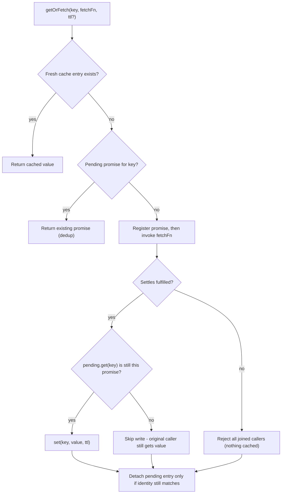
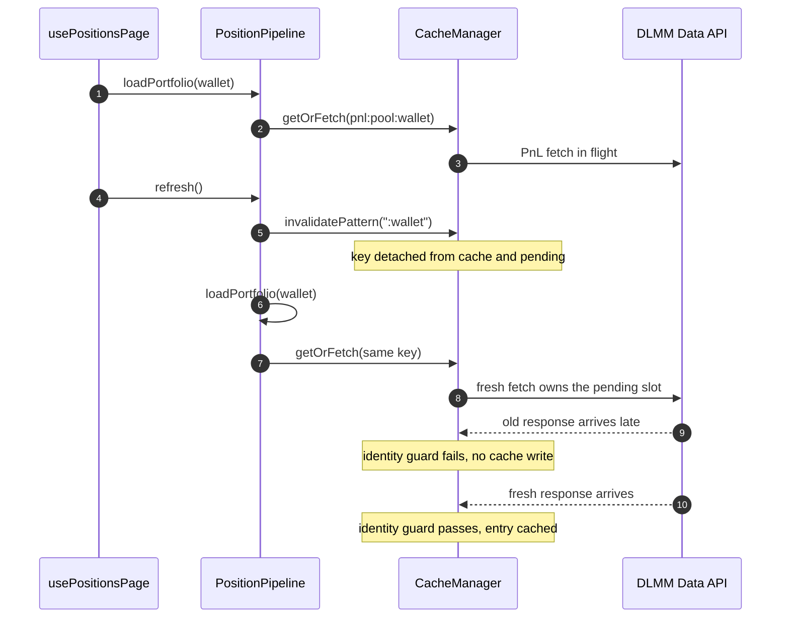

# Caching Strategy

Every transient network fetch in the app funnels through one in-memory cache:
`CacheManager` (`src/utils/cache/CacheManager.ts`). The position pipeline's
per-pool PnL fetches, the token-price service behind every position card, the
display-only OHLCV chart series, and the SOL→USD price all read and write
through it. The cache is deliberately thin — TTL expiry, request
deduplication, and explicit invalidation — and deliberately non-durable: it is
never persisted and exists only inside a single JS context. What earns it a
page of its own is the precision of its invalidation semantics: a detached
in-flight request still finishes for its original callers, yet can never
repopulate the cache or corrupt a replacement's result.

## The CacheManager contract

The whole cache is two `Map`s on one instance: `cache` (key →
`{ value, expiresAt }`) and `pending` (key → in-flight `Promise`). Reads,
writes, and invalidation treat the two maps as a unit:

| Member | Behavior |
| --- | --- |
| `get(key)` | Cached value or `null`; expired entries are dropped on read. Cannot distinguish a missing key from a cached `null`. |
| `set(key, value, ttl?)` | Writes `expiresAt = now + ttl` (default 15 min) and **deletes any pending promise for the key** — an explicit write supersedes in-flight work. |
| `has(key)` | Existence check with expiry applied. |
| `delete(key)` | Removes the cached entry **and** the pending promise. |
| `clear()` | Empties both maps. |
| `invalidatePattern(pattern)` | `delete`s every key — cached **or** pending — that contains `pattern` as a substring. |
| `getOrFetch(key, fetchFn, ttl?)` | Cache-aside read with deduplication; see below. |

Expiry is inclusive and lazy: an entry is dead once `Date.now() >= expiresAt`,
so it disappears exactly at its deadline (a zero TTL is dead on arrival).
Expiration is paid on read, plus a counter-driven sweep every 50th read/write
(`maybeCleanup`) that evicts expired entries nobody reads anymore, so the map
cannot grow without bound. Pending promises are never swept — only
invalidation and settlement remove them.

In production, all writes go through `getOrFetch`; `set` is used by tests to
seed state (and by the semantics below to model "an explicit write wins").
Every production call site passes an explicit TTL from `CACHE_TTL`, so the
15-minute default only applies to ad-hoc `set` calls.



*The `getOrFetch` decision path. The identity guard (`pending.get(key) === promise`) is what makes invalidation safe.*

Three properties of this path matter whenever cache behavior changes:

- **Dedup of concurrent callers.** A second `getOrFetch` for the same key
  while one is in flight joins the existing promise instead of calling
  `fetchFn` again — one network call, every caller gets the same outcome.
- **Registration before invocation.** The promise is placed in `pending`
  before `fetchFn` actually runs (`Promise.resolve().then(fetchFn)`), so even
  a fetcher that throws synchronously deduplicates: concurrent callers share
  the one rejection, and the freed pending slot lets a later call retry.
- **Failures are never cached.** Only a fulfilled fetch reaches `set`; a
  rejection propagates to all joined callers and leaves no entry, so the next
  request retries cleanly. The pipeline's "partial PnL is never cached"
  behavior is exactly this rule plus all-or-nothing pagination in `dlmmApi`.
- **Nulls are cached like values.** `getOrFetch` checks entry *existence* (not
  truthiness), so a fetched `null` is cached and deduplicated for its TTL even
  though `get()` alone could not distinguish it from a miss.

## Invalidation during flight

`delete`, `clear`, and `invalidatePattern` all detach pending work. The
detached promise chain keeps running — the original caller still receives its
outcome — but the identity guard makes the cache write a no-op:



*A pull-to-refresh invalidates the wallet while the previous load's PnL fetch is still in flight. The late first response cannot repopulate the cache, and the replacement fetch owns the key.*

The invariants proven by `src/__tests__/stores/CacheManager.test.ts` (a
`describe.each` matrix runs all of them for `delete`, `clear`, and
`invalidatePattern`):

1. **Invalidated data is never restored.** When the old request completes
   after invalidation, its value reaches the original caller, but
   `cache.has(key)` stays false.
2. **A replacement request starts immediately and is protected.** A
   `getOrFetch` after invalidation launches a fresh fetch that owns the
   pending slot. The old request's settlement — resolve *or* reject — can
   neither overwrite the fresh result nor detach its pending entry, so a third
   caller arriving later still deduplicates onto the replacement.
3. **Explicit writes win.** `set` deletes the pending entry first, so a
   late-arriving response from a superseded fetch cannot overwrite the value
   just written explicitly.
4. **Pattern invalidation preserves unrelated pending work.** Only keys
   containing the pattern are touched; non-matching in-flight requests keep
   their pending entries and continue to deduplicate.

The mechanism behind all four is the same guard checked twice per fetch: once
before caching the value, and once in `finally` before removing the pending
entry. Invalidation removes the entry from `pending`, so a superseded promise
fails both checks — it writes nothing and deletes nothing that belongs to a
newer request.

## Wallet invalidation

`PositionPipeline.invalidateWallet(walletAddress)` is the single invalidation
entry point, and it is deliberately suffix-scoped:

```ts
this.cache.invalidatePattern(`:${walletAddress}`)
```

The key grammar makes this work: `pnl:{poolAddress}:{walletAddress}` is the
only key family that *ends* with the wallet address, so the pattern matches
every PnL entry (cached or still in flight) for that wallet, across all its
pools — and nothing else. `token_data:{mint}` entries survive (prices are
wallet-independent), `ohlcv:*` entries survive, and other wallets' PnL entries
survive. The scope test populates all three families and asserts exactly this
survival pattern.

`usePositionsPage` invokes it at every data boundary:

- **Wallet change** — the *previous* address is invalidated before the new
  wallet's portfolio loads, so stale PnL can never bleed across a
  connect/switch/disconnect transition.
- **Every refresh** — `refresh()` invalidates the current wallet before
  `loadPortfolio`, covering pull-to-refresh and the silent 60-second
  foreground auto-refresh, which calls the same `refresh({ silent: true })`
  path.

Because invalidation also detaches pending fetches, the first responses of any
superseded load arrive too late to matter: they resolve into the awaiters that
started them (the abandoned screen update still completes) but fail the
identity guard, so the repopulated cache contains only post-invalidation data.

## Cache keys and TTLs

All TTLs live in `src/config/cache.ts`:

| Key | Producer | TTL | Notes |
| --- | --- | --- | --- |
| `token_data:{mint}` | `TokenService.getPrice` / `getPrices` | 60 s (`CACHE_TTL.TOKEN_DATA`) | Wallet-independent; also serves SOL via the wrapped-SOL mint for `getCurrentSolUsdPrice` |
| `ohlcv:{pairAddress}:{timeframe}` | `OhlcvService.getOhlcv` | 60 s (`CACHE_TTL.OHLCV`) | **Display-only** per ADR 0001; each timeframe is a distinct key |
| `pnl:{poolAddress}:{walletAddress}` | `PositionPipeline.fetchAllPnL` | 15 min (`CACHE_TTL.UPNL_PER_POSITION`) | The only wallet-scoped family; ends with the wallet, which suffix invalidation relies on |

Notes on the producers:

- **TokenService.** `getPrices` runs one `getOrFetch` per mint under
  `Promise.allSettled` and omits mints whose fetch rejects — a partial failure
  still returns the successes, and each mint caches independently. Because
  every position card, the pipeline, and the SOL price read the same keys,
  60 seconds of TTL buys process-wide deduplication of token RPC traffic.
- **OhlcvService.** Candles come from `fetchPoolOhlcv` (a pure fetch with no
  caching of its own) and are cached under pool + timeframe. ADR 0001
  carves this out explicitly: the series exists solely for the in-card price
  chart and must never feed PnL or value computation. `usePoolOhlcv` relies on
  the cache for cross-card dedup — one fetch per pool+timeframe even when many
  position cards render.
- **PnL.** `fetchAllPnL` fetches per pool with `status: 'open'`, wrapped in
  its own `try/catch` so one failing pool never blocks the others. The
  15-minute TTL is long because this data changes slowly relative to price,
  and every refresh invalidates it anyway before re-fetching.

## Singleton vs `createFresh()`

`CacheManager` has a private constructor and two creation paths:

- **`getInstance()`** — the lazily created, process-wide singleton. This is
  the production default everywhere: `createDataServices()` without arguments,
  `PositionPipeline`'s `deps?.cache ?? CacheManager.getInstance()`, and
  therefore `usePoolOhlcv`, `getCurrentSolUsdPrice`, and the widget syncs all
  share one cache, one dedup pool, and one TTL namespace at runtime.
- **`createFresh()`** — documented "for testing only": an independent, empty
  instance. Tests build one per test and inject it through the dependency
  seams (`createDataServices(freshCache)`, `createPositionPipeline({ cache })`),
  which lets pipeline tests exercise the real cache against stubbed
  transports while staying isolated from each other.

Because the singleton is per-JS-context and the cache is never persisted, a
headless widget sync (its own JS context) starts with an empty cache and
re-fetches; nothing the app process cached is visible to it, and vice versa.

## Focused tests

- `src/__tests__/stores/CacheManager.test.ts` — the contract itself: inclusive
  TTL deadlines, zero-TTL non-retention, dedup of concurrent and
  synchronously-throwing fetchers, null-result caching, error propagation with
  retry after failure, the invalidation-during-flight matrix, and pending-only
  pattern matches.
- `src/__tests__/services/data.test.ts` — the services' keying: per-mint
  caching and batch partial failure, OHLCV re-fetch per pool and per
  timeframe.
- `src/__tests__/services/positionPipeline.test.ts` — `invalidateWallet`
  scoping (what survives and what does not) and PnL caching across paginated
  loads, including no partial caching on page failure.

## Related pages

- `/openwiki/architecture/data-pipeline.md` — the pipeline that drives these
  fetches and its error degradation
- `/openwiki/architecture/state-and-persistence.md` — why the cache is the
  non-persisted tier next to MMKV
- `/openwiki/concepts/domain-model.md` — PnL/uPnL vocabulary used by the PnL
  cache entries
