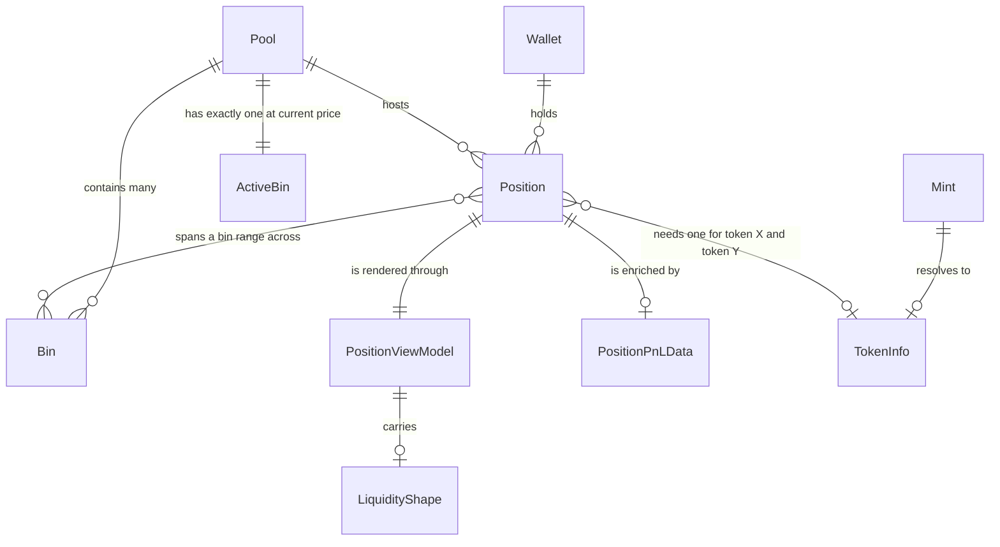

# Domain Model & Vocabulary

`UBIQUITOUS_LANGUAGE.md` is the canonical glossary for this codebase; this page
carries its terms into the wiki, maps them onto the concrete types that embody
them, and preserves the flagged ambiguities that have caused real bugs. Two
rules govern every page in this wiki:

- **Prose uses the canonical terms.** Say **Position**, **Pool**, **uPnL**,
  **wallet ready** — not the aliases flagged on each term below.
- **Code identifiers are never renamed.** The code keeps `pairAddress`,
  `pnlSol`, `token_data:`, and friends; the vocabulary tells you how to
  *read* them correctly.

## The core nouns



*A Wallet holds zero or more Positions, each inside one Pool; a Pool contains many Bins and marks exactly one as active. Each Position is displayed through one PositionViewModel, which optionally carries a LiquidityShape, and is optionally enriched by PositionPnLData from the DLMM Data API.*

The relationship chain in code: a wallet address feeds
`DLMM.getAllLbPairPositionsByUser`, which returns a `Map` of pair address →
`PositionInfo`; each `PositionInfo` carries multiple `lbPairPositionsData`
entries, so **one pool can hold several Positions for the same wallet and the
position count can exceed the pool count** (the pipeline flattens the map into
one `ResolvedPosition` per entry, keyed `"<position public key>-<index>"`).

| Term | Meaning | In code | Avoid |
| --- | --- | --- | --- |
| **Wallet** | The user's Solana wallet; an address for sign-in and position queries | `walletAddress: string \| undefined` | account, signer, keypair |
| **Position** | A single liquidity provision in a DLMM pool, spread across a bin range | `PositionData`, `ResolvedPosition` | LB position, stake |
| **Position address** | The on-chain public key identifying one Position | `positionAddress`, `position.publicKey` | position key, pubkey |
| **Pool** | A Meteora DLMM liquidity pool (an `LbPair` on-chain) | — (user-facing term only) | pair, market |
| **Pair address** | The on-chain public key of a Pool | `pairAddress` | pool address, lbPair address |
| **Bin** | A discrete price bucket within a Pool; pools hold many bins at incrementally higher prices | `PositionBinData`, `binId` | tick, step |
| **Bin range** | The lower–upper bin IDs spanning a Position's liquidity | `lowerBinId`, `upperBinId` | tick range |
| **Active bin** | The Bin at the current market price of the Pool | `position.lbPair.activeId` | current price level |
| **In range / Out of range** | Position's bin range includes / excludes the Active bin | `vm.inRange` | active, inTicks, inactive |
| **Range low / high price** | The price of the lowest / highest bin of the Bin range | first/last `binDistribution[].price` | range floor, low bin price |
| **Token X / Token Y** | Base / quote token of the Pool pair | `tokenX`, `tokenY`, `tokenXInfo` | tokenA, tokenB |
| **Token info** | Metadata for a token: mint, symbol, decimals, icon, price per token | `TokenInfo` | token data, token metadata |
| **Mint** | The on-chain token address; the lookup key for Token info | `tokenXMint`, `mint` | token address |
| **Unrealized fees** | Fees accrued but not yet claimed, in both tokens | `positionData.feeX`, `feeY` | pending fees, earned fees |
| **Claimed fees** | Fees already withdrawn | `totalClaimedFeeXAmount`, `totalClaimedFeeYAmount` | collected fees |
| **uPnL** | Unrealized PnL — current value minus initial deposit | `pnlSol`, `pnlSolPctChange` (misleadingly named!) | floating PnL |
| **PnL** | The general profit/loss concept, including aggregates | — | profit, return |
| **Position view model** | Display-ready object computed from raw data | `PositionViewModel` | VM, display model |
| **Liquidity shape** | Chart data for a Position's bin distribution | `LiquidityShape` | chart data, bin data |
| **Cache manager** | In-memory singleton with TTL and dedup | `CacheManager` | cache, memo |
| **Data services** | Facade providing the Token service and OHLCV service | `createDataServices()` | service layer |
| **Wallet ready** | The wallet provider has resolved (address available or timed out) | `walletReady` | wallet resolved |

## In range: the definition everything leans on

A Position is **In range** exactly when the pool's **Active bin** ID falls
within the Position's **Bin range**:

```ts
const inRange = positionData ? activeId >= positionData.lowerBinId && activeId <= positionData.upperBinId : false
```

In range means the position is **currently earning fees**; out of range means
it is not. The bounds are inclusive on both ends (an active bin equal to
`lowerBinId` or `upperBinId` is in range), and a missing `positionData`
yields `inRange: false` — never an exception. `vm.inRange` drives the card's
IN RANGE / OUT OF RANGE badge, the portfolio's `outOfRangeCount`, and the
background task's out-of-range transition alerts.

Do not confuse the **bin range** (IDs) with its price endpoints: the
**Range low price** and **Range high price** are the prices of the endpoint
bins, not the IDs themselves. `PriceChart` takes them from the first and last
`binDistribution` entries to draw the shaded position band, and
`LiquidityBarChart` shows them as axis labels.

## Tokens, mints, and prices

**Token info** is the TypeScript interface `TokenInfo` — `mint`, `symbol`,
`supply`, `decimals`, `cdn_url`, and `price_info.price_per_token` — fetched
from the Solana RPC `getAsset` method and cached by the Token service under
keys prefixed `token_data:` (see the [flagged
ambiguities](#flagged-ambiguities)). **Mint** is the lookup key; the pipeline
collects the unique mints of every position's token X and token Y and
batch-fetches them with per-mint failure isolation (a failed mint yields a
missing map entry, read back as `null`).

Token info is *load-bearing for display*: when either token's info is missing,
`computePositionViewData` degrades to `$0.00` value strings, `-` fee
displays, and a `null` liquidity shape; the card renders a skeleton while
both token infos are `null`, and the list-level `tokenDataReady` flag gates
the whole screen until at least one token info has resolved.

**Current price** is the exchange rate expressed as Token X price denominated
in Token Y — computed as `tokenXInfo.price_info.price_per_token /
tokenYInfo.price_info.price_per_token` and rendered as the price-line label
shared by both charts.

## PnL and uPnL: the naming trap

The fields `pnlSol` and `pnlSolPctChange` — on the `PositionPnLData` wire
type *and* on `PositionViewModel` — hold **uPnL** (unrealized PnL: current
value minus initial deposit), despite the `pnl` name. This is an upstream
naming convention the codebase inherits and deliberately does not rename.
Display code always treats them as uPnL (`formatUPNLDisplaySol` /
`formatUPNLDisplay`, the header's color coding, the widget's `+/-X.XXXX SOL`
line).

Use **uPnL** when referring to this unrealized figure; use **PnL** for the
general concept or aggregated amounts (the summary's `totalPnlSol` is PnL in
the general sense and is likewise unrealized in nature, sourced from the same
API rows).

At the view-model boundary, `parsePnlNumber` normalizes the API's
string-or-number wire values: missing, blank, or non-finite values become
`null`, while an actual `0` is preserved. "Unknown" and "zero profit" must
stay distinguishable — an unavailable uPnL renders as a hidden placeholder,
never as a fabricated zero.

## The Position view model

`PositionViewModel` is produced by `computePositionViewData`, a **pure
function** — no store access, no side effects — mapping `{ positionData,
activeId, positionAddress, poolAddress, tokenXInfo, tokenYInfo, pnlData }`
to a display-ready object. It carries two kinds of fields:

- **Pre-formatted display strings**: `totalValue`, `currentPrice`,
  `unrealizedFeesDisplay` / `claimedFeesDisplay` (dual-token
  `"1234.56 BONK / 0.0023 SOL"` pairs via `formatTokenAmount`, which keeps at
  most six decimal digits and trims trailing zeros), and
  `unrealizedFeesValue` / `claimedFeesValue` (`$X.XX`). USD values here come
  from each token's own `price_per_token` — they are independent of the
  SOL/USD display toggle below.
- **Structured numbers**: `inRange`, `feesTvl24h` (a daily *ratio*), and
  `pnlSol` / `pnlSolPctChange` (the uPnL fields, normalized to finite
  numbers or `null`).

Missing inputs degrade rather than throw: no `positionData` or missing token
info yields the `$0.00` / `-` defaults above; missing PnL yields `null`
fields; and only when position data *and* both token infos exist is the
liquidity shape generated.

## Liquidity shape

`LiquidityShape` is the per-bin, **SOL-denominated** distribution of a
Position: `binRange` (`minBinId`, `maxBinId`, `totalBins`), a
`binDistribution` of `ChartBinData` — one entry per bin from `lowerBinId`
through `upperBinId`, where the X-side amount is converted at that bin's
`pricePerToken` (after decimal scaling) and the Y-side amount passes through
unscaled — plus `tokenTotals` and `currentActiveId`. Missing bins render as
zero, so the shape always spans exactly the position's bin range.

One shape, three consumers:

- **`LiquidityBarChart`** (app) — bars of combined per-bin liquidity, colored
  by position relative to `currentActiveId`, after downsampling through
  `downsampleChartBins` to at most `MAX_CHART_BINS` (100) peak-bin buckets.
- **`PriceChart`** (app) — the first/last bin prices become the Range
  low/high price band over OHLCV candles; `pairAddress` keys the candle fetch.
- **`buildLiquidityGraph`** (Android widget) — the same shape serialized to a
  raw SVG string (≤48 bars, peak-bin sampling, active-bin marker), persisted
  inside the widget's MMKV snapshot.

## Summaries: Pool PnL summary vs Portfolio summary

The vocabulary distinguishes a **Pool PnL summary** (all of a wallet's
Positions in one Pool) from a **Portfolio summary** (all pools, one wallet).
Read the code accordingly:

- `computePoolPnLSummary` (`PoolPnLSummary`) is the aggregation function —
  but in the in-app path `computeSummary` *flattens every pool's PnL rows*
  through it, so the type named "Pool" PnL summary actually carries the
  app's **Portfolio summary** (`PortfolioSummaryData` = `PoolPnLSummary` +
  `positionCount`). Its totals are all SOL-denominated.
- The widget's portfolio summary takes a separate server-totals path
  (`/portfolio/open`) and never builds `PoolPnLSummary`.

The per-position cost basis inside the aggregation is *net* (gross deposits −
gross withdrawals, falling back to value − uPnL when no deposit data exists),
and both weighted figures (percent, 24 h fees/TVL) are weight-adjusted means.
The arithmetic is documented on the [Position Data
Pipeline](/openwiki/architecture/data-pipeline.md) page; the vocabulary point
is only the name-vs-scope mismatch.

The **24h fees/TVL** ratio crosses a unit boundary worth memorizing: the
Meteora API returns a *percentage* string (`"1.31"` = 1.31 % daily);
`parseFeePerTvl24h` divides by 100 so every stored value is a *ratio*
(`0.0131`), and `formatFeesTvl24h` multiplies by 100 for display.

## Display currency: SOL-native values with an optional USD lens

Every aggregated figure the app computes — summary totals, uPnL — is
**SOL-native**. USD is a presentation-time conversion, not a parallel
computation:

- The lens is `settingsStore.displayCurrency` (`'SOL' | 'USD'`, the
  `DisplayCurrency` type), persisted with the rest of the settings store;
  the `PortfolioSummary` header hosts the segmented SOL/USD toggle.
- The conversion rate is `solUsdPrice`, fetched live by
  `getCurrentSolUsdPrice()` from the **wrapped-SOL mint**
  (`So11111111111111111111111111111111111111112`) through the shared,
  60 s-TTL token service — so SOL's own price is just another Token info. It
  is `null` while loading or on failure, and threads from
  `usePositionsPage` through the list into the summary and every card.
- In USD mode, summary figures render via
  `formatUsdFromSol(sol, solUsdPrice)` and the card header renders uPnL as
  `formatUPNLDisplay(upnlValue * solUsdPrice, pct)`; if the price is missing
  the header falls back to the SOL rendering.

### Null and placeholder behavior

The formatters encode one convention everywhere: **missing data renders as a
benign placeholder, never `NaN` and never a fabricated number.**

| Function | Input | Output |
| --- | --- | --- |
| `formatUSD` | any finite number | `$X.XX` (en-US, 2 decimals; negatives render as `$-100.50`) |
| `formatUsdFromSol` | null / non-finite price **or** amount | `$0.00` |
| `formatUPNLDisplaySol` / `formatUPNLDisplay` | null / undefined uPnL **or** percent | `''` (empty string) |
| `formatFeesTvl24h` | null / non-finite ratio | `—` (em dash) |
| `parseFeePerTvl24h` | missing / non-finite / negative | `null` |
| `parsePnlNumber` (view-model boundary) | missing / blank / non-finite | `null` (a real `0` is preserved) |

`PositionHeader` adds one UI-level rule on top: when uPnL itself is `null`,
the line renders a fixed placeholder string (`+$0.00 (+0.00%)` /
`+0.0000 SOL (+0.00%)`) at `opacity-0`, so card layout does not shift while
PnL data is pending.

## Wallet ready

**Wallet ready** is the canonical term for "the wallet provider has
resolved": `walletReady` is true when the provider's `accounts` state is
non-null **or** the 500 ms fallback timeout elapsed with no wallet. Once a
valid account has been seen, readiness latches — disconnect never flips it
back to false. An earlier alias, `walletResolved`, was renamed to
`walletReady` across `useWalletLifecycle` and `PositionsPageResult`; the two
names no longer coexist.

Readiness gates the screen's state machine: the positions list shows a
**Skeleton** while `!walletReady || !tokenDataReady || (no positions &&
loading)`, an **Empty state** when ready with no positions, and **Data**
otherwise — the four mutually exclusive states defined in the ubiquitous
language, with the stale-state indicator as a possible overlay on Data.

## Flagged ambiguities

These are inherited verbatim from `UBIQUITOUS_LANGUAGE.md` because each has
caused (or invites) real misreadings:

| Flag | Code reality | Canonical usage |
| --- | --- | --- |
| **`pairAddress` (code) vs Pool (UI)** | The variable is `pairAddress` (matching DLMM's `LbPair`): the map key from `getAllLbPairPositionsByUser`, the `LiquidityShape.pairAddress` field, and the OHLCV cache-key component. The same value also flows into fields literally named `poolAddress` (`ResolvedPosition.poolAddress`, `ComputePositionViewDataInput.poolAddress`, the `pnl:{poolAddress}:{walletAddress}` cache key). | **Pool** in user-facing text; **pair address** in code and data keys. Both identifiers hold the same on-chain key — never "rename" either. |
| **`pnlSol` holds uPnL** | `pnlSol` / `pnlSolPctChange` on `PositionPnLData` and `PositionViewModel` are unrealized (value − deposit); upstream naming, kept as-is. | **uPnL** when specifically referring to the unrealized figure; **PnL** for the general concept. |
| **`token_data:` (cache key) vs Token info (type)** | Cache keys are `token_data:{mint}`; the TypeScript interface is `TokenInfo`. | **Token info** in conversation and docs; `token_data:` only inside cache-key strings. |
| **`lowerBinId`/`upperBinId` vs Range low/high price** | Those fields are bin **IDs**; the endpoint **prices** are separate values derived from the shape's first/last bin. | **Range low price / Range high price** as display terms; bin IDs stay bin IDs. |
| **`walletReady` vs `walletResolved`** | Both meant the same state; the alias was renamed away, so the code now says `walletReady` uniformly. | **Wallet ready.** |
| **`PoolPnLSummary` name vs portfolio scope** | The type is named "Pool" PnL summary, but the in-app path aggregates *all* pools through it into the Portfolio summary. | Call the per-scope concept **Pool PnL summary**; call the app's headline figure the **Portfolio summary**. |

## Related pages

- `/openwiki/architecture/data-pipeline.md` — how the terms map onto the
  five-step pipeline and its error degradation
- `/openwiki/concepts/caching.md` — the Cache manager, TTLs, and the
  `token_data:` / `pnl:` key conventions
- `/openwiki/workflows/positions-screen.md` — the screen states that wallet
  readiness and token readiness gate
