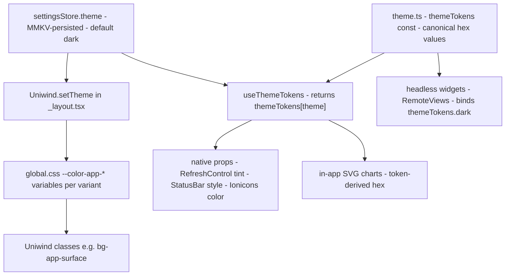

# Theming & Design System

Yonks' visual system is earthy and instrument-like rather than neon-on-black
crypto: a sage primary (`app-primary`), a copper secondary (`app-secondary`),
and a single clay-red (`app-negative`) reserved for loss and error, over
neutral grayscale. The architecture that keeps that system coherent has one
rule at its core: **every hex value lives in exactly one place**, and every
rendering surface — Uniwind classes, JS-driven native props, in-app SVG, and
headless Android widgets — derives its colors from that place instead of
restating values. `DESIGN.md` is the written source of truth for *how to use*
the tokens; `src/config/theme.ts` is the machine source of truth for the
values themselves.

## Two token surfaces, one source of truth

`src/config/theme.ts` defines the `ThemeTokens` interface and exports
`themeTokens`, a pure constant record keyed by `ThemeMode` (`'dark' | 'light'`,
dark first — dark is the default and the more considered theme). The
`as const satisfies Record<ThemeMode, ThemeTokens>` check makes the compiler
enforce that both modes define the identical key set.

`src/global.css` mirrors every color as a Uniwind CSS variable
(`--color-app-*`) inside `@variant dark` / `@variant light` blocks, and defines
the four font families under `@theme`. A header comment on the CSS file points
back to `theme.ts` as the source of truth, and a vitest suite
(`src/__tests__/config/theme.test.ts`) enforces the mirror mechanically: it
regex-extracts the variables from each variant block and spot-checks them
against the token values (case-insensitively), and it asserts key parity
between the two modes. Changing a hex therefore means two edits plus one
test run — the test fails if the CSS copy drifts.

The token families:

| Family | Tokens | Purpose |
| --- | --- | --- |
| Surfaces | `bg`, `surface`, `surfaceHighlight`, `border` | Screen, cards, recessed fills, hairlines (and skeleton blocks) |
| Accents | `primary`, `secondary` (+ `-dim`, `primaryDark`) | Sage and copper, with tint variants for badge/selected backgrounds |
| Negative | `negative`, `negativeDim` | Clay-red for loss/error, plus its badge tint |
| On-container/on-accent | `primaryDimText`, `secondaryDimText`, `negativeDimText`, `onPrimary`, `onSecondary` | Text/icons sitting on tinted or full-strength fills |
| Text | `text`, `textSecondary`, `textMuted` | Three-step text hierarchy |
| Native-only | `refreshTint`, `statusBar` | Props Uniwind cannot set (`RefreshControl` tint, status-bar style) |

## How a theme reaches a pixel

Three consumption paths leave `theme.ts`, all driven by the same
`settingsStore.theme` value (a zustand store persisted to MMKV, default
`'dark'`):

- **Class path** — `_layout.tsx` runs `Uniwind.setTheme(theme)` in an effect,
  which switches which CSS variable set from `global.css` is active. Components
  then use plain Uniwind classes (`bg-app-surface`, `text-app-text-muted`).
- **JS path** — `useThemeTokens()` returns `themeTokens[theme]` for anything
  that needs a value in JavaScript: native props, icon colors, SVG derivations.
- **Headless path** — Android widgets import the `themeTokens` constant
  directly and bind `themeTokens.dark` (see below).

*One store value selects the variant for the class and JS paths; the headless
widget path skips React entirely and reads the dark constants at module scope.*

## Semantic color mapping

State colors are **mapped onto the accent palette** rather than forming a
separate design language:

| State | Token | Where it shows up |
| --- | --- | --- |
| Profit, in-range, accruing | `app-primary` (sage) | PnL ≥ 0, "IN RANGE" badge, unrealized fees |
| Loss, error | `app-negative` (clay-red) | PnL < 0, denied-permission text, down candles |
| Out-of-range, caution, claimed | `app-secondary` (copper) | "OUT OF RANGE" badge, claimed fees, dev banner, out-of-range banner |

This is visible consistently across the position surfaces: `PositionHeader`
renders the range badge as a `primaryDim`/`secondaryDim` background with the
matching text color; `PortfolioSummary` picks `text-app-primary` vs
`text-app-negative` for the hero PnL from the sign of `totalPnlSol`;
`PositionFooter` colors unrealized (accruing) fees sage and claimed fees
copper — state is carried by color, never emoji. The dev-mode banner,
error states, and the home-screen widgets apply the same mapping.

## On-container and on-accent pairs

Text or icons sitting on a tinted fill always use the **paired on-color
token**, never the raw accent:

- Dim fills take their `-dim-text` partners: `primaryDimText`,
  `secondaryDimText`, `negativeDimText`.
- Full-strength accent fills take `onPrimary` / `onSecondary` — e.g. the
  "Dev Mode — Mock Data" banner, the error state's "Try again" button, and the
  FontPicker's check circle.

The pairing exists for contrast: `theme.ts` documents that raw `negative` on
`negativeDim` is 4.18:1 — below AA for small text — so copy on `negativeDim`
must use `negativeDimText` (5.36:1). Each pair is a real token per theme, not
an opacity hack; this replaces the old raw-alpha pattern
(`bg-emerald-500/20`-style) that did not theme.

## Typography

Four font roles, configured in `global.css` under `@theme`:

| Role | Family / access | Used for |
| --- | --- | --- |
| Sans | `font-sans` (Geist-Regular) | Default body/UI text |
| Sans bold | `font-sans-bold` (Geist-Bold) | **All** bold weight — labels, eyebrows, headings |
| Pixel | `usePixelFont()` → inline `fontFamily` | Numbers, values, SOL amounts, PnL |
| Mono | `font-mono` (DepartureMono-Regular) | Chart axis labels, price chips — tabular reference data only |

Two rules are enforced, not aspirational:

- **Never `font-bold`.** It renders faux-bold on Geist-Regular; the real Bold
  cut is exposed as the `font-sans-bold` class, and the codebase contains zero
  `font-bold` occurrences. The one-style eyebrow
  (`text-app-text-muted text-[10px] font-sans-bold tracking-wider`) is used
  for every section header and chart title.
- **The pixel font is the only runtime-configurable role**, so it never travels
  as a class. `PixelFontProvider` (mounted at the app root in
  `_layout.tsx`) reads `settingsStore.pixelFont`, resolves it through
  `getPixelFontFamily()` (`config/fonts.ts`: Geist Pixel ↔ Departure Mono,
  unknown ids fall back to the default), and publishes it via React context.
  `usePixelFont()` returns the family string, applied as
  `style={{ fontFamily }}`.

## Surfaces that can't use classes

Several surfaces consume colors through native props or SVG attributes that
Uniwind cannot process. The rule: even outside `className`, the value still
comes from a token — never a restated hex literal.

- `RefreshControl` `tintColor` → `tokens.refreshTint`
- `expo-status-bar` `style` → `tokens.statusBar` (`'light' | 'dark'`)
- `Ionicons` `color` → the relevant token (`textSecondary`, `textMuted`, …)
- `PixelAvatar` SVG fills → resolved from `themeTokens[theme]` (it reads the
  store directly rather than the hook)
- Chart SVG strokes/fills → token-derived (next section)

## Charts consume tokens, not classes

Both in-card charts render SVG via `react-native-svg`, so they call
`useThemeTokens()` and derive SVG-compatible strings. The alpha convention is
an 8-digit hex suffix appended to the 6-digit token: `1F` ≈ 0.12, `4D` ≈ 0.3,
`80` ≈ 0.5.

**Liquidity bar chart** — bars are colored by state: the active bin gets
`tokens.primary` (sage), bins below the active price get `tokens.secondary`
(copper), bins above stay neutral `tokens.border`, and grid lines are
`border` + `4D`. A dashed 1.5px active-bin marker (`3 3` dash plus a small
pointer) slides between bin centers over 500ms — but only when the same
position at the same layout width sees its active bin move; mount and card
recycling jump directly.

**Price candlestick chart** — up candles use `tokens.primary` and down
candles `tokens.negative` (the profit/loss mapping again); the position's
range band fills with `primary`+`1F` and its edges are `primary`+`80`; grid
lines are `border`+`4D`.

The legends are the exception that proves the rule: legend swatches are plain
Uniwind classes (`bg-app-primary`, `bg-app-secondary`), so they track the
theme automatically without SVG derivation.

## Headless widgets: same tokens, native RemoteViews

The home-screen widgets render to **native Android RemoteViews** through
`react-native-android-widget` (`FlexWidget`/`TextWidget`/`SvgWidget`) — there
are no Uniwind classes on that surface and no React hooks available in the
headless task-handler context. Instead of threading a theme, both widgets bind
a module-level constant, `const C = themeTokens.dark`, exactly like the
in-app components would bind `useThemeTokens()`:

- `updatePortfolioWidget.tsx` (portfolio summary widget) and
  `PositionLiquidityWidget.tsx` both bind `themeTokens.dark`.
- `liquidityGraph.ts`, the widget's liquidity-shape SVG builder, imports the
  same constants and reuses the same derivations (active bin sage, below-price
  copper, neutral border, dashed marker).

Consequences worth keeping in mind:

- **The widgets are dark-only and SOL-only by design.** A glanceable readout
  has no theme or currency toggle; a light-theme user still gets the dark
  widget.
- **A hex change in `theme.ts` propagates into the widgets automatically**, since
  they consume the constant rather than a copy. The widget tests pin this: they
  assert the rendered SVG contains `themeTokens.dark.primary` /
  `themeTokens.dark.secondary` literally, proving the shared source.
- Widget state colors follow the same semantic mapping as the app — PnL hero
  sage/clay-red, out-of-range warning copper, refresh affordance turning sage
  while a refresh is in flight.

## Shared primitives and skeletons

Three primitives are the single implementations of their patterns; new
surfaces import them rather than re-rolling markup, so rhythm and selected
state cannot drift:

- **`ChartPanel`** — chart header + body, rendered directly on the card
  surface: eyebrow title left, current price as quiet mono text right, no
  nested container (it previously wrapped charts in a recessed panel, creating
  a box-in-a-box inside the card).
- **`SegmentedControl`** — the single source for segmented toggles; both the
  chart-mode and SOL/USD currency controls render through it. Selection is a
  sliding `primaryDim` indicator pill tracked to measured item geometry (stiff
  M3-style spring, one whisper of overshoot) with the label color crossfading
  over 130ms; `ReduceMotion.System` honors the OS reduce-motion setting.
- **`ShimmerBlock`** — the **only** shimmer implementation (a 2s repeating
  reanimated opacity loop, 0.4 → 0.7). A duplicate that once lived in
  `PositionCardSkeleton` was removed.

Skeleton rules (both `PositionCardSkeleton` and the card-less
`PortfolioSummarySkeleton`, which mirrors the hero's bare treatment): the
skeleton keeps the loaded card background (`bg-app-surface`, no overlay);
placeholder blocks use `bg-app-border` for contrast; static labels (eyebrows)
do not shimmer; and the skeleton layout matches the real component so nothing
shifts on load.

The signature layout convention sits above all of this: the portfolio hero is
**card-less by design** — the PnL delta sits bare on the background at
instrument scale (`text-4xl` pixel, sage or clay-red), with total value as the
neutral anchor line beneath — which is what distinguishes "the portfolio" from
the boxed position cards. Every interactive `Pressable` gets
`active:opacity-80` as its state layer (exceptions: press-to-dismiss scrims
and stop-propagation containers).

## Enforcement and audits

The conventions (from `DESIGN.md`, echoed in `AGENTS.md`) with teeth:

- **Never raw Tailwind palette classes** (`emerald-*`, `red-*`, `zinc-*`,
  …) — they don't theme and clash with the palette.
- **Never `font-bold`** — use `font-sans-bold`.
- **Never hardcode hex in components** — read `useThemeTokens()`; even native
  props take token values.
- **Never mix inline `style` and `className`** for the same property — inline
  wins.
- **Never duplicate `ShimmerBlock`** or the chart panel wrapper.
- **Keep `theme.ts` and `global.css` in sync** when changing a value.

Two audits back the sync rule:

- `src/__tests__/config/theme.test.ts` — the compile-time-adjacent guard:
  key parity between modes and CSS-variable-vs-token spot checks for both
  variants (runs as part of `npm test` / `vitest run`).
- `scripts/palette-check.py` — the rendered-pixel guard: it audits a
  web-capture PNG against a token table duplicated from `theme.ts`
  (`TOLERANCE = 8` per channel), auto-detects which theme the capture is in by
  scoring which token set covers more sampled pixels (`--theme` overrides;
  it fails when the best match covers under 20%), and prints per-token
  coverage. A missing token may legitimately not render on the audited screen,
  so the report says to check before treating absence as drift — this catches
  the CSS variables drifting from `theme.ts` as actually seen on screen.

## Doc authority

`DESIGN.md` is the source of truth for the design system and **supersedes**
the historical `docs/wiki/concepts/Theming.md` and `docs/raw/theme-guide.md`
pages — those still carry outdated values (for example the old
`app-surface`/`app-border` dark shades and different light-theme accents) and
explicitly defer to `DESIGN.md` where they disagree. When in doubt:
`theme.ts` is the ground truth for color, `DESIGN.md` for how to use it.

## Focused tests

- `src/__tests__/config/theme.test.ts` — the keep-in-sync contract: dark/light
  key parity, and per-variant spot checks that the regex-extracted
  `--color-app-*` values equal the `themeTokens` values (case-insensitive).
- `src/__tests__/widgets/positionLiquidityWidget.test.ts` — pins the widget's
  token consumption: the rendered liquidity SVG must contain the literal
  `themeTokens.dark` hex values for the active/marker (primary) and
  out-of-range marker (secondary) strokes.

## Related pages

- `/openwiki/concepts/platform-seams.md` — the web preview that
  `palette-check.py` audits and the headless context that forbids widget hooks
- `/openwiki/workflows/widget-sync.md` — how widget renders get triggered and
  ordered
- `/openwiki/workflows/positions-screen.md` — the screen whose surfaces
  (hero, cards, charts, skeletons) apply these tokens
- `/openwiki/operations/build-and-tooling.md` — where the vitest and audit
  scripts sit in the workflow
