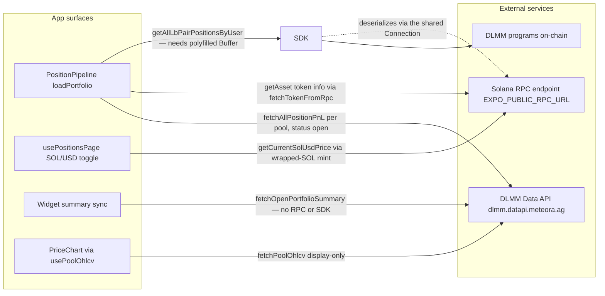

# Solana & Meteora Integrations

Everything the app knows about positions, prices, and pools crosses one of
three external boundaries: a **Solana RPC endpoint**, the **Meteora DLMM
SDK** (which reads on-chain programs through that RPC), and the **Meteora
DLMM Data API** (a hosted REST service). This page documents each boundary's
owner, contract, failure semantics, and configuration. The internal
orchestration that *consumes* these surfaces lives on
[Position Data Pipeline](/openwiki/architecture/data-pipeline.md); how they
are cached is on [Caching Strategy](/openwiki/concepts/caching.md).



*Each app surface and the external service it calls. The widget path
deliberately touches no RPC and no SDK.*

## The shared RPC connection

`src/config/connection.ts` owns the app's single `Connection` from
`@solana/web3.js`. `getSharedConnection()` is a lazy singleton: the first
caller constructs it from `env.rpcUrl`, and every later caller reuses the
same instance.

The laziness is load-bearing. When `EXPO_PUBLIC_RPC_URL` is unset,
`getSharedConnection` throws a setup-guidance error — *"copy .env.example to
.env and set your RPC endpoint before fetching on-chain data"* — but that only
happens when something actually scans the chain. Constructing a
`PositionPipeline` never touches the connection (it resolves
`getSharedConnection()` on first use, not in the constructor), which is why
web mock mode and tests can build the whole pipeline without any RPC
configuration.

`src/config/env.ts` maps the three external-facing variables from
`.env.example`:

| Variable | `env` field | Used by |
| --- | --- | --- |
| `EXPO_PUBLIC_RPC_URL` | `env.rpcUrl` | `getSharedConnection`, `fetchTokenFromRpc` |
| `EXPO_PUBLIC_HELIUS_API_KEY` | `env.heliusApiKey` | surfaced but not referenced by any code path today — reserved for "enhanced data fetching" |
| `EXPO_PUBLIC_DEV_MOCK` | `env.devMock` | forces mock data when `1`; **always** mock on web (`Platform.OS === 'web'`) |

One operational consequence: because token metadata is fetched by POSTing a
`getAsset` JSON-RPC call to `env.rpcUrl` itself (see below), the configured
endpoint must support the DAS `getAsset` method — Helius and other enhanced
endpoints do, the default public mainnet RPC may not. Setting only
`EXPO_PUBLIC_HELIUS_API_KEY` does nothing.

## The Meteora DLMM SDK — one call, Buffer-dependent

The production code's only use of `@meteora-ag/dlmm` is the on-chain scan in
`PositionPipeline.loadPortfolio`:

```ts
const positionsMap = await DLMM.getAllLbPairPositionsByUser(this.connection, new PublicKey(walletAddress))
```

Everything else about positions (prices, PnL, view models) comes from other
surfaces. The SDK call returns a `Map` of pair address → `PositionInfo`,
deserialized by Anchor underneath — and Anchor plus `buffer-layout` require
Node `Buffer` methods that Hermes does not provide. That is why
`index.js` imports `./polyfill` before the router: `polyfill.js` installs the
craftzdog Buffer, patches `subarray`/`slice`/`equals`, and forwards
`readIntLE`-style methods onto `Uint8Array.prototype` so the SDK can
deserialize account data. If the SDK throws "`X` is not a function" for a
Buffer method `X`, the fix is in the polyfill, not the SDK — see
[Platform Seams](/openwiki/concepts/platform-seams.md) for the full patch
mechanics and load-order rules.

## The owned DLMM Data API client (`dlmmApi.ts`)

`src/services/dlmmApi.ts` is the app's own typed transport for the officially
documented DLMM Data API, based at `DLMM_API_BASE =
'https://dlmm.datapi.meteora.ag'`. It replaced the `metcomet` package so the
wire types, error semantics, and pagination live in this repo. Three
endpoints are used:

| Function | Endpoint | Consumer |
| --- | --- | --- |
| `fetchPositionPnL` / `fetchAllPositionPnL` | `GET /positions/{pool}/pnl` | pipeline's per-pool PnL step |
| `fetchOpenPortfolio` / `fetchOpenPortfolioSummary` | `GET /portfolio/open` | Android portfolio-summary widget |
| `fetchPoolOhlcv` (in `src/services/ohlcv.ts`, same base URL) | `GET /pools/{address}/ohlcv` | in-card price chart |

### Explicit typed errors — no silent nulls

Every transport failure raises `DlmmApiError`. A non-OK HTTP response carries
the status code; a network-level rejection carries `status: null`. The client
never returns `null` to paper over a failure — if a caller wants to degrade,
it catches `DlmmApiError` and decides. Only an OK response with parseable JSON
reaches the caller.

### All-or-nothing pagination

Both list endpoints paginate (`DEFAULT_PAGE_SIZE = 50`, page 1 upward, driven
by the server's `hasNext` flag). `fetchPages` walks pages until `hasNext` is
false but enforces a hard cap of `MAX_PAGES = 10` — and if the cap is reached
before the server reports completion, it **throws**
(`"DLMM API pagination exceeded 10 pages; result is incomplete"`) instead of
returning what it has. The contract is deliberate: no consumer ever sees a
partial result presented as complete, and because only resolved promises reach
the cache, a mid-pagination failure leaves no cache entry so the next load
retries cleanly. `fetchAllPositionPnL` (pipeline path) and
`fetchOpenPortfolioSummary` (widget path) both inherit this behavior.

### Money values are strings until the consumer converts them

USD and SOL figures on the wire (`usd`, `sol`, `pnlSol`, `balancesSol`,
`totalDeposit`, …) are decimal **strings**, transcribed from the documented
response schema. The transport never converts them; consumers do
(`Number(summary.total.pnlSol)`, `parseFloat(...)`, etc.). The one tolerated
variance is `pnlSol` / `pnlSolPctChange`, typed `string | number | null`
because older API responses used numbers or omitted the SOL fields — legacy
responses normalize at the view-model boundary, not in the client.

### Server totals + the two client rollups

`fetchOpenPortfolioSummary` walks every page of `/portfolio/open` and returns
an `OpenPortfolioSummary`. The server already aggregates `total` (USD and SOL
numeraires) and keeps `totalCount` global across pages; the client rolls up
the two fields the server does not:

- `outOfRangeCount` — Σ `positionsOutOfRange.length` across all pages' pools.
- `feesTvl24h` — pool-value-weighted mean of `feePerTvl24h`, weighted by each
  pool's `balancesSol`. `parseFeePerTvl24h` (`src/utils/positions/formatters.ts`)
  converts the API's percentage form (`"1.31"` = 1.31% daily) into the
  internal ratio `0.0131`; the rollup is `null` when no pool carries a weight.

Per ADR 0002 (`docs/adr/0002-widget-summary-from-server-totals.md`, covered
on [Widget Sync](/openwiki/workflows/widget-sync.md)), the widget reads these
server totals directly via this client: a data path with **no RPC, SDK, or
Helius dependency**. It derives its deposited figure as
`totalValueSol - totalPnlSol`. The client deliberately does **not** roll up
per-pool `totalDepositSol`: that figure is gross and double-counts
redeposits after a withdrawal, so the docstring forbids it and the widget
derives a net basis from the value/uPnL pair instead.

## Token info via `getAsset` (`src/tokens/index.ts`)

Token metadata and per-token USD pricing arrive from a single JSON-RPC call,
keyed by **mint**. `fetchTokenFromRpc(mint)` POSTs a Helius-style `getAsset`
request — `params: { id: mint, displayOptions: { showFungible: true } }` — to
`env.rpcUrl` and maps the result into the `TokenInfo` shape:

```ts
{
  mint, symbol, supply, decimals, cdn_url,
  price_info: { price_per_token, currency }
}
```

HTTP failures and JSON-RPC `error` payloads both throw — like the DLMM
client, there are no silent nulls; the cached `TokenService` layer (below)
decides how failures degrade. `price_info.price_per_token` is the **live-spot
price** that all value and PnL math is required to use (ADR 0001, below).

`WRAPPED_SOL_MINT = 'So11111111111111111111111111111111111111112'` is the
constant that turns this same token-info path into an SOL→USD price source.
`getCurrentSolUsdPrice` (`src/services/solPrice.ts`) calls
`tokens.getPrice(WRAPPED_SOL_MINT)` through the shared cache, validates the
result is a finite number, and returns `null` on any failure (logged, never
thrown). `usePositionsPage` calls it on wallet change and on refresh to feed
the SOL/USD display toggle. Because it flows through
`token_data:{mint}` caching, repeated calls are nearly free.

## Data services: the cached facade over RPC and OHLCV

`createDataServices()` (`src/services/data.ts`) wraps the raw fetches in the
`CacheManager` singleton and exposes two services:

- **`TokenService`** — `getPrice(mint)` and batch `getPrices(mints)`, cached
  60 s under `token_data:{mint}`. The batch runs one `getOrFetch` per mint
  under `Promise.allSettled` and **omits mints whose fetch rejected**, so a
  partial RPC failure returns the successes and the pipeline tolerates the
  missing entries as `null` token info.
- **`OhlcvService`** — `getOhlcv(pairAddress, timeframe)`, cached 60 s under
  `ohlcv:{pairAddress}:{timeframe}` (each timeframe is a distinct key). The
  cross-card dedup this provides is why many position cards render with one
  fetch per pool.

A fresh `CacheManager` can be injected for tests; see
[Caching Strategy](/openwiki/concepts/caching.md) for the underlying TTL,
dedup, and invalidation semantics.

## OHLCV: display-only price history

`fetchPoolOhlcv(pairAddress, timeframe)` (`src/services/ohlcv.ts`) fetches
candles from `GET /pools/{address}/ohlcv?timeframe=…` on the same DLMM API
base URL (duplicated as the local constant `METEORA_DLMM_API` — change both
together). Supported timeframes are `5m | 30m | 1h | 2h | 4h | 12h`, default
`DEFAULT_OHLCV_TIMEFRAME = '4h'` (~40 hours of history). The function is a
pure fetch — no caching, no singleton — that coerces string-valued fields to
numbers and returns an empty candle list when the response carries no `data`
array; non-OK responses throw `OHLCV HTTP error: {status}`.

Two contract points matter:

- **Units.** The series is denominated in the pool's native Token X / Token Y
  ratio — the same units as a bin's `pricePerToken`. That is what lets
  `PriceChart` draw the candle line and a position's Range low/high price on
  one shared y-axis with no conversion (the chart derives its scale from the
  candles plus the `liquidityShape` bin prices).
- **Display-only, by ADR.** The header comment, the `CACHE_TTL.OHLCV`
  annotation, and the `usePoolOhlcv` docstring all state the same rule: this
  data feeds the in-card price chart and must **never** feed PnL or value
  computation. `usePoolOhlcv` serves a deterministic mock series under
  `env.devMock` so the web preview renders candles without any network.

## ADR 0001 — live-spot pricing is binding

ADR 0001 (`docs/adr/0001-no-local-historical-pricing.md`) governs every
integration above:

- Every monetary value derives from **live-spot** prices —
  `TokenInfo.price_info.price_per_token`, with SOL priced through the
  wrapped-SOL mint.
- There is **no local historical price computation** — no OHLCV fetcher for
  math, no Pyth benchmarks, no local historical-SOL lookup. Historical-SOL
  PnL, when required, comes from the DLMM Data API's server-aggregated
  endpoints, not client-side computation.
- OHLCV is the sanctioned carve-out: a **display-only** read for the planned
  in-card price chart (now built as `PriceChart`), never an input to value or
  PnL math.

The ADR records that this capability was built and removed **twice** (a
`PriceService` with OHLCV + Pyth fetchers; a Helius-based true-SOL-numeraire
PnL), each time duplicating work the server already does and risking a second
PnL definition that disagrees with Meteora's own numbers. Treat "add a
value-over-time chart" or "compute real-SOL PnL locally" impulses as already
answered.

## Configuration & operations

- **Setup:** copy `.env.example` to `.env`; set `EXPO_PUBLIC_RPC_URL` to a
  DAS-`getAsset`-capable endpoint (Helius recommended). Missing it fails at
  first chain access with the setup error, not at boot.
- **Error posture:** RPC-side failures (token fetches) surface as thrown
  errors caught by the caching services; Data API failures surface as
  `DlmmApiError` caught and degraded per pool by the pipeline. The widget
  summary path fails hard on `DlmmApiError` and renders its error widget.
- **Mock mode:** `EXPO_PUBLIC_DEV_MOCK=1` (or any web run) bypasses every
  external surface — mock portfolio, mock SOL price, mock OHLCV.

## Focused tests

- `src/__tests__/services/dlmmApi.test.ts` — the client contract: documented
  URL construction, `DlmmApiError` with/without status, pagination walk,
  exactly-10-page limit rejection vs. completion on the last allowed page,
  rollup math, and no partial rollups when a later page fails.
- `src/__tests__/utils/dataFetching.test.ts` — `fetchTokenFromRpc`: request
  shape (`"getAsset"`, mint in `params.id`), response mapping, HTTP and
  JSON-RPC error throws.
- `src/__tests__/services/ohlcv.test.ts` — candle numeric coercion
  (string-valued fields), timeframe passthrough and default, HTTP error,
  empty-`data` tolerance.
- `src/__tests__/services/data.test.ts` — the cached facade: per-mint
  caching, batch partial-failure isolation, OHLCV keying by pool + timeframe.
- `src/__tests__/services/positionPipeline.test.ts` — the surfaces composed:
  real client + pagination against a stubbed transport, mocked SDK and token
  fetchers.

## Related pages

- `/openwiki/architecture/data-pipeline.md` — the pipeline that composes these surfaces
- `/openwiki/concepts/caching.md` — TTL/dedup semantics behind `createDataServices`
- `/openwiki/concepts/platform-seams.md` — the Buffer polyfill the DLMM SDK depends on
- `/openwiki/concepts/domain-model.md` — PnL/uPnL vocabulary and live-spot terms
- `/openwiki/workflows/widget-sync.md` — the server-totals widget path (ADR 0002)
