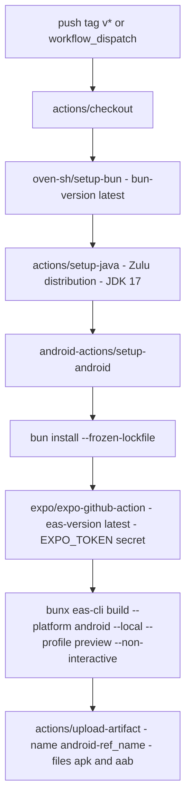

# Build, Tooling & Release

Yonks is developed with **Bun** as the package manager and script runner
(`bun.lock` is committed), type-checked with the native-preview TypeScript
compiler (`tsgo`), formatted with **oxfmt**, and linted with **ESLint** using
Expo's flat config. Native projects are never hand-maintained: `android/` is
generated by `expo prebuild` and gitignored, so every durable native
customization must live in `app.json` as a config plugin. That makes `app.json`
an **integration surface runtime code depends on**, not just metadata — widget
code matches widget declaration names by string, font lookups reference bundled
font family names, and the Gradle heap fix only exists because prebuild
regenerates `gradle.properties`.

There are two check pipelines and one release pipeline:

- **`bun run ci`** — the machine check: type check, lint check, format check,
  Android prebuild.
- **The AGENTS.md before-commit list** — the human check: `tsgo --noEmit`,
  `bun run lint`, `bun run fmt`, `bun run build`, `bun run test`.
- **A `v*` tag push** — the release: a GitHub Actions workflow runs a *local*
  EAS build of the `preview` profile and uploads the APK as a run artifact.

## Toolchain and scripts

All day-to-day commands live in `package.json` and are run via `bun run`
(`bunx` for one-off tools):

| Script | What it actually runs |
| --- | --- |
| `bun run build` | `tsgo --noEmit && expo prebuild -p android` — "build" means *type check + regenerate the native project*, not compile a bundle |
| `bun run ci` | `tsgo --noEmit && expo lint && oxfmt --check . && expo prebuild -p android` |
| `bun run lint` / `lint:check` | `expo lint --fix` (auto-fix) / `expo lint` (report only — what CI uses) |
| `bun run fmt` / `fmt:check` | `oxfmt --write .` / `oxfmt --check .` |
| `bun run dev` | `expo start --clear --dev-client --reset-cache` |
| `bun run android` / `ios` / `web` / `start` | `expo run:android` / `run:ios` / `start --web` / `start` |
| `bun run test` / `test:watch` / `test:coverage` | Vitest run / watch / V8 coverage |
| `bun run doctor` | `expo-doctor` health check |

Type checking runs through `tsconfig.json`, which only extends
`expo/tsconfig.base` and turns on `strict` — all other compiler behavior comes
from the Expo base.

## Type checking: `tsgo`, never `tsc`

The repo's TypeScript compiler is `@typescript/native-preview` (the `tsgo`
binary, invoked as `tsgo --noEmit`). AGENTS.md states the rule twice and in
bold: **do not use `tsc`**. Every aggregate script (`build`, `ci`) and the
before-commit list call `tsgo --noEmit` directly; there is no script that
shells out to plain `tsc`. If a type error report was produced with `tsc`, redo
it with `tsgo` — the native-preview compiler is the source of truth for whether
the tree type-checks.

## Formatting and linting

**oxfmt** owns formatting via `.oxfmtrc.json` (migrated from Prettier):

- `printWidth: 120`, `semi: false` (no semicolons), `singleQuote: true`,
  `arrowParens: always`, `trailingComma: all`, 2-space indent.
- `ignorePatterns` protects generated and vendored trees: `/android`, `/ios`,
  `/dist`, `/coverage`, `/.expo`, `pnpm-lock.yaml`, and notably
  `/src/uniwind-types.d.ts` — a *generated* file (see Metro below) that must
  never be hand-formatted.

**ESLint** uses the Expo flat config (`eslint.config.js` composes
`eslint-config-expo/flat` through `defineConfig`, ignoring `dist/*`).
`bun run lint` auto-fixes; `bun run lint:check` is the non-mutating variant
that `bun run ci` runs. Both formatting and lint failures are gate failures —
neither tool is advisory.

## Metro: the Uniwind pipeline is mandatory

`metro.config.js` takes Expo's default config and wraps it in
`withUniwindConfig` from `uniwind/metro`:

```js
const uniwindConfig = withUniwindConfig(config, {
  cssEntryFile: './src/global.css',
  dtsFile: './src/uniwind-types.d.ts',
})
```

This is not optional decoration. The Uniwind Metro plugin is what compiles
`src/global.css` (the `@theme` font roles and the per-variant
`--color-app-*` design tokens) and generates `src/uniwind-types.d.ts`. If a
build path bypasses this config — a custom config that forgets the wrapper,
or a tool that bundles without Metro — **Uniwind classes silently stop
working**: no CSS variables are produced, styling resolves to nothing, and
nothing throws. Any new entry point that processes this repo must go through
this exact Metro config.

## `app.json`: config as an integration surface

`expo prebuild` turns `app.json` into the native project on every build. Four
of its sections are load-bearing for code:

### Widget declarations are load-bearing names

The `react-native-android-widget` plugin declares two home-screen widgets, and
widget code matches their `name` strings **literally**:

| `name` (matched in code) | Label | Min / target size | Resize | Update period |
| --- | --- | --- | --- | --- |
| `PortfolioSummary` | Yonks Portfolio | 320×110dp / 4×2 cells | vertical | 1800000 ms (30 min) |
| `PositionLiquidity` | Yonks Positions | 320×320dp / 4×4 cells | horizontal + vertical | 1800000 ms (30 min) |

- `src/widgets/syncPortfolioWidget.ts` queries
  `getWidgetInfo('PortfolioSummary')` with a module-local
  `WIDGET_NAME = 'PortfolioSummary'` constant.
- `src/widgets/syncPositionWidgets.tsx` exports
  `POSITION_WIDGET_NAME = 'PositionLiquidity'`, which the shared task handler
  (`portfolioWidgetTaskHandler.tsx`) dispatches on before falling through to
  the portfolio widget.
- Both `updatePeriodMillis` values equal 30 minutes — the same cadence as the
  app's foreground sync interval and the background task's
  `minimumInterval: 1800` seconds, so the OS clock refresh and the app's own
  syncs agree.

Renaming a widget in `app.json` without renaming the code constants (or vice
versa) orphans the widget: `getWidgetInfo` finds no instances, and clicks stop
routing. The plugin also renders the picker previews from
`assets/widget-preview/*.png` and turns the declarations into manifest
receivers.

### Fonts: bundled once, referenced by family name

The `expo-font` plugin bundles exactly four files from `assets/fonts/`:

| File (bundled) | Family name consumers use |
| --- | --- |
| `GeistPixel-Square.ttf` | `--font-pixel` in `global.css`; `fontFamily: 'GeistPixel-Square'` in `config/fonts.ts` |
| `Geist-Regular.ttf` | `--font-sans` (`font-sans` class) |
| `Geist-Bold.ttf` | `--font-sans-bold` (`font-sans-bold` class — the only sanctioned bold) |
| `DepartureMono-Regular.otf` | `--font-mono`; the alternate pixel-font option in `config/fonts.ts` |

`src/global.css` maps them to Uniwind roles under `@theme`, and
`src/config/fonts.ts` exposes the two pixel fonts (Geist Pixel ↔ Departure
Mono, default `geist-pixel`) as runtime-configurable `fontFamily` strings.
Every lookup is **by family name, not path** — removing or renaming a bundled
file without updating the CSS roles and `PIXEL_FONT_OPTIONS` breaks the
references at runtime (text falls back or the font picker resolves to nothing).

### Permissions and notification color

The Android config declares `android.permission.POST_NOTIFICATIONS` — required
for the local out-of-range notifications the background task sends through
`expo-notifications` — and explicitly **blocks**
`android.permission.SYSTEM_ALERT_WINDOW`. The `expo-notifications` plugin sets
the notification accent color to `#8FA893` (the sage `app-primary`). Removing
the permission makes the alert feature silently inert (notification sends
fail); the blocked permission keeps overlays from ever being requested.

### `withGradleHeap`: keeping prebuild from OOM-ing a release

`plugins/withGradleHeap.ts` is a local config plugin registered as
`./plugins/withGradleHeap` in `app.json`. It wraps `withGradleProperties` and
rewrites any `org.gradle.jvmargs` value's `-Xmx` to `-Xmx4096m` (Expo's default
is `-Xmx2048m`), leaving `MaxMetaspaceSize` untouched.

The reason is documented in the plugin itself: the `v4.5.8-beta` tagged build
failed with `Java heap space` in AGP's `:app:compileReleaseArtProfile` task —
after every compile/dex step had succeeded — because the Gradle daemon's 2 GB
heap is too tight for a multi-ABI release build. The fix **must** be a config
plugin: `expo prebuild` regenerates `android/gradle.properties` every build (and
`android/` is gitignored), so editing the file by hand cannot persist. The
plugin is wrapped in `createRunOncePlugin('with-gradle-heap', '1.0.0')`, so it
applies exactly once per prebuild.

### EAS project identity

`extra.eas.projectId` (`c6fde4df-25cc-4220-98ad-2888d07b8eea`) plus
`owner: armariya` tie every EAS build — and the EAS Observe telemetry the app
emits — to the right Expo project. Observe is configured in code, not config:
`src/app/_layout.tsx` calls `Observe.configure({ integrations: { 'expo-router':
true } })` at module scope (toggling it later throws), and the root layout is
wrapped in `ObserveRoot.wrap` to measure Time to First Render. All Observe
calls flow through the `src/observe` platform seam (real `expo-observe` on
native, no-op stubs on web), so nothing Observe-related loads on web.

Also in `app.json`: `experiments.reactCompiler: true` enables the React
Compiler, and `userInterfaceStyle: automatic` lets the OS supply the default
appearance — which the app immediately overrides by driving
`Uniwind.setTheme` from the persisted `settingsStore` (the store, not the OS
setting, is the theme authority).

## `eas.json`: build profiles

| Profile | Behavior |
| --- | --- |
| `development` | Dev client (`developmentClient: true`), internal distribution, `environment: development` |
| `preview` | Internal distribution, `android.buildType: apk` — **the profile the tag workflow builds** |
| `production` | `autoIncrement: true` (store build; no explicit buildType, so the default AAB) |
| `dapp-store` | APK build in the `production` environment with EAS-managed env bindings for `EXPO_PUBLIC_RPC_URL` and `EXPO_PUBLIC_HELIUS_API_KEY`, plus `EAS_GRADLE_CACHE=1` |

At the CLI level: `cli.version: ">= 18.0.3"` and `appVersionSource: "remote"` —
the version code/authority lives on EAS's side, not in the repo, which is what
lets `autoIncrement` work for the production/dapp-store profiles. `submit` has
an empty `production` entry (submission config placeholder).

## Release path: the tag-triggered Android build

`.github/workflows/android-build.yml` ("Android Tagged Build (Bun)") triggers
on any pushed tag matching `v*`, plus `workflow_dispatch` for manual runs. The
whole build happens **on the GitHub runner** (`eas build --local`), not in
EAS cloud:



*The tagged release: Bun + JDK 17 + the Android SDK are provisioned on the
runner, dependencies install reproducibly from the lockfile, and a local EAS
build of the `preview` profile produces the APK that gets uploaded as the run
artifact.*

Details that matter when operating it:

- **Secrets required**: `EXPO_TOKEN` (EAS authentication) and, injected as env
  into the build step, `EXPO_PUBLIC_RPC_URL` and
  `EXPO_PUBLIC_HELIUS_API_KEY` — the latter two become the `EXPO_PUBLIC_*`
  build-time env the app reads through `src/config/env.ts`. A run without them
  builds an APK whose RPC configuration is empty.
- **`--profile preview`** selects the APK-producing, internal-distribution
  profile from `eas.json`; `--non-interactive` is mandatory on CI.
- **`--local`** means the Gradle build runs on the runner itself — this is the
  path the `withGradleHeap` plugin exists to protect (see above), and why the
  workflow must install the Android SDK and JDK 17 itself.
- **Artifact**: `actions/upload-artifact@v7` with name
  `android-<tag-ref>` capturing `*.apk` and `*.aab`, so the tag name is the
  artifact name.

## Operational scripts

Two scripts under `scripts/` support development workflows; neither is part of
CI.

### `palette-check.py` — rendered-pixel token audit

`python3 scripts/palette-check.py <png> [--theme dark|light]` audits a web
preview screenshot against a token table duplicated from
`src/config/theme.ts` (per-channel `TOLERANCE = 8`). It auto-detects which
theme the capture is in by scoring which token set covers more sampled pixels
and **exits nonzero if the best match covers under 20%** — usually meaning a
capture taken mid-boot or of a non-app surface. It prints per-token coverage;
a missing token may legitimately not render on the audited screen, so absence
is a prompt to check, not automatically drift. This is the rendered-pixel
companion to the `theme.test.ts` CSS-mirror test (see
[Theming & Design](/openwiki/concepts/theming-and-design.md)) and needs
`pip install pillow` plus the agent-browser capture flow documented in
AGENTS.md.

### `preview-position-widget.mjs` — widget layout preview

`bun scripts/preview-position-widget.mjs` renders the **production**
`PositionLiquidityWidget` JSX to static HTML for visual checks and picker art:
it uses `bun:test`'s `mock.module` to stub `react-native-android-widget` and
`env`, feeds the widget mock portfolio data and `themeTokens.dark`, and writes
`.expo/position-widget-preview.html` plus
`.expo/position-widget-audit.html` (cases: minimum size, larger size,
out-of-range, refresh-failed, disconnected). It is a layout preview only —
native RemoteViews still require device testing.

## Before committing

AGENTS.md's required sequence — run all five, not a subset:

1. `tsgo --noEmit` — no type errors (never `tsc`)
2. `bun run lint` — fix lint issues
3. `bun run fmt` — format
4. `bun run build` — type check + prebuild succeed
5. `bun run test` — the full Vitest suite passes

`bun run ci` is the non-mutating subset of the same gates (type check, lint
check, format check, prebuild) and is what a clean tree must survive.

## Related pages

- `/openwiki/quickstart.md` — getting a dev environment running
- `/openwiki/concepts/platform-seams.md` — the Metro platform splits and
  polyfills this toolchain compiles, and the web preview `palette-check.py`
  audits
- `/openwiki/concepts/theming-and-design.md` — the token sources of truth the
  fonts, colors, and audit scripts in this page revolve around
- `/openwiki/testing/strategy.md` — the Vitest harness behind `bun run test`
