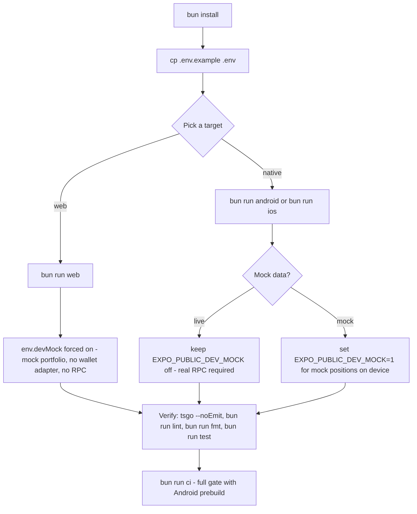

# Quickstart

This page gets a coding agent from clone to a running app and a clean verification loop: install dependencies, configure environment variables, pick a dev target (native device/emulator or the web mock preview), and check changes with the repo's gate. It ends with a routing map into the rest of the wiki.

Standing rule from [`AGENTS.md`](../AGENTS.md): **source code and tests are authoritative**. The generated `openwiki/` index is optional just-in-time context, not startup reading, and agents should prefer the narrowest quiet validation that proves the changed behavior.

## Prerequisites and install

The repo is driven with [bun](https://bun.sh):

```bash
bun install
```

The GitHub Actions Android build installs with `bun install --frozen-lockfile`, so keep `bun.lock` consistent when changing dependencies. Two `.env`-adjacent notes: `.env` is gitignored (create it below), and the `build`/`ci` package scripts internally chain through `npm run`, so npm must exist on `PATH` even when you drive everything with bun.

## Environment variables

Copy the example and fill in what you need:

```bash
cp .env.example .env
```

| Variable                     | Value                                                                                                                    | Used for                                                                                   |
| ---------------------------- | ------------------------------------------------------------------------------------------------------------------------ | ------------------------------------------------------------------------------------------ |
| `EXPO_PUBLIC_RPC_URL`        | Solana RPC endpoint — Helius, Triton, or the public mainnet RPC (example default: `https://api.mainnet-beta.solana.com`) | The shared `Connection` for all on-chain reads, and token metadata via the `getAsset` call |
| `EXPO_PUBLIC_HELIUS_API_KEY` | Helius API key (optional)                                                                                                | Enhanced data fetching                                                                     |
| `EXPO_PUBLIC_DEV_MOCK`       | `1` to render mock positions instead of on-chain data; `0`/unset for live (defaults off)                                 | Dev-only mock portfolio; always on for web (see below)                                     |

Everything is read through `src/config/env.ts` — `env.rpcUrl`, `env.heliusApiKey`, `env.devMock`. Never use `process.env` directly in components. Zod validation is present but commented out, so values are consumed as-is. If `EXPO_PUBLIC_RPC_URL` is missing, the failure is deferred and actionable: the shared connection is created lazily, and the first on-chain fetch throws an error telling you to copy `.env.example` to `.env` — constructing the pipeline itself never needs an RPC URL.

## Run the app



Command choice decides the data mode; every path ends in the same verification loop.

### Native (Android / iOS)

- `bun run dev` — Expo dev server with cache reset (`expo start --clear --dev-client --reset-cache`). Use with a development client build.
- `bun run android` / `bun run ios` — prebuild and run on a device or emulator (`expo run:android` / `expo run:ios`).
- `bun start` — Expo without the dev client.

Native boot order is fixed and matters when debugging SDK crashes: `index.js` imports `polyfill.js` first (the React Native Buffer/crypto patches that keep the Solana and Meteora SDKs working on Hermes), then `expo-router/entry`, then registers the Android widget task handler. Don't reorder these; see [concepts/platform-seams.md](concepts/platform-seams.md) for the patch inventory.

### Web (auto mock mode)

```bash
bun run web        # http://localhost:8081; add -- --lan for other devices
```

The web target exists purely as a mock-data visual preview: `env.devMock` is **always true when `Platform.OS === 'web'`** (or when `EXPO_PUBLIC_DEV_MOCK=1` anywhere). No wallet adapter, no RPC, no network — you get a static mock portfolio from `src/services/mockPortfolio.ts` and deterministic, seeded mock candles from `src/services/mockOhlcv.ts`. This makes web the fastest loop for UI iteration and screenshots.

What to expect on web:

- A `Dev Mode — Mock Data` banner under the header confirms mock is active.
- `useWalletLifecycle` short-circuits to a toggleable fake wallet (ready by default with address `DeVMoCK1Wallet…`); toggling it off exercises the disconnected/empty states. `usePositionsPage` bypasses the pipeline entirely, so pull-to-refresh is a no-op.
- Native-only seams are stubbed via platform-split files — Metro loads the `.web` variant only on web: `polyfill.web.js`, `src/wallet/walletKit.web.tsx`, `src/hooks/useWidgetSync.web.ts`, `src/widgets/registerWidgetTask.web.ts`. Keep each export pair in sync when changing either side.
- Theme is **store-driven** (`settingsStore`, dark by default) — browser media emulation does nothing. To capture light-mode boot states, seed `localStorage` with the persisted `settings\settings-store` value before reopening.

For headless UI observation, AGENTS.md prescribes the `agent-browser` loop: open the page, `wait --text "DEPOSITED"` for the mount marker, read `agent-browser console`, and screenshot to an absolute path. Then audit the capture against the design tokens:

```bash
python3 scripts/palette-check.py .expo/web-capture.png
```

`palette-check.py` compares the PNG's pixels to `src/config/theme.ts` (auto-detecting dark/light; requires `pip install pillow`), catching Uniwind CSS variables drifting out of sync with the canonical tokens.

## Verify your changes

The loop from AGENTS.md, in order:

1. `tsgo --noEmit` — type check. **Never `tsc`**: the repo uses the TypeScript native preview (`@typescript/native-preview`), which is not drop-in compatible.
2. `bun run lint` — ESLint with auto-fix (`expo lint --fix`); use `bun run lint:check` for a read-only check.
3. `bun run fmt` — format with oxfmt (config in `.oxfmtrc.json`: 120 columns, no semicolons, single quotes); `bun run fmt:check` for CI parity.
4. `bun run test` — run all Vitest suites once; `bun run test:watch` and `bun run test:coverage` for iteration and V8 coverage.
5. `bun run ci` — the full gate: `tsgo --noEmit` + lint check + format check + Android prebuild. `bun run build` is type check + prebuild without the checks in between.

Prefer the narrowest quiet validation that proves the changed behavior (e.g. a single Vitest file) and only run `bun run ci` before handing off.

Tests live in `src/__tests__/`, mirroring the `src/` layout. The Vitest environment is `node` with globals enabled; `src/__tests__/setup.ts` mocks React Native and expo-router core modules; module aliases map `@` → `src` and redirect `expo-observe` to its web no-op stub so hooks that emit Observe events stay importable. Coverage is scoped to `src/utils/`, `src/stores/`, and `src/hooks/`. See [testing/strategy.md](testing/strategy.md) for what the suites actually pin down.

## Where to go next

| Need                                                                                                                   | Read                                                                                                                                                                                                                                                             |
| ---------------------------------------------------------------------------------------------------------------------- | ---------------------------------------------------------------------------------------------------------------------------------------------------------------------------------------------------------------------------------------------------------------- |
| System boundaries — app shell, pipeline, stores, widgets, and how they bound each other                                | [architecture/overview.md](architecture/overview.md), then [architecture/data-pipeline.md](architecture/data-pipeline.md) and [architecture/state-and-persistence.md](architecture/state-and-persistence.md)                                                     |
| End-to-end behavior — boot & wallet lifecycle, the positions screen, widget sync, out-of-range alerts                  | [workflows/app-boot-and-wallet.md](workflows/app-boot-and-wallet.md), [workflows/positions-screen.md](workflows/positions-screen.md), [workflows/widget-sync.md](workflows/widget-sync.md), [workflows/out-of-range-alerts.md](workflows/out-of-range-alerts.md) |
| Invariants and vocabulary — domain terms (Position, Pool, Bins, uPnL), caching contract, design tokens, platform seams | [concepts/domain-model.md](concepts/domain-model.md), [concepts/caching.md](concepts/caching.md), [concepts/theming-and-design.md](concepts/theming-and-design.md), [concepts/platform-seams.md](concepts/platform-seams.md)                                     |
| External surfaces — Solana RPC, the Meteora DLMM SDK and Data API, Helius metadata, OHLCV                              | [integrations/solana-and-meteora.md](integrations/solana-and-meteora.md)                                                                                                                                                                                         |
| Tooling and release — bun scripts, Expo app.json plugins, EAS profiles, tag-triggered builds                           | [operations/build-and-tooling.md](operations/build-and-tooling.md)                                                                                                                                                                                               |
| How tests are structured and what they guard                                                                           | [testing/strategy.md](testing/strategy.md)                                                                                                                                                                                                                       |
