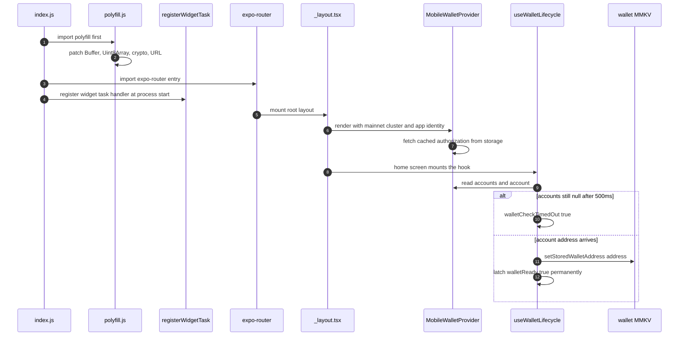
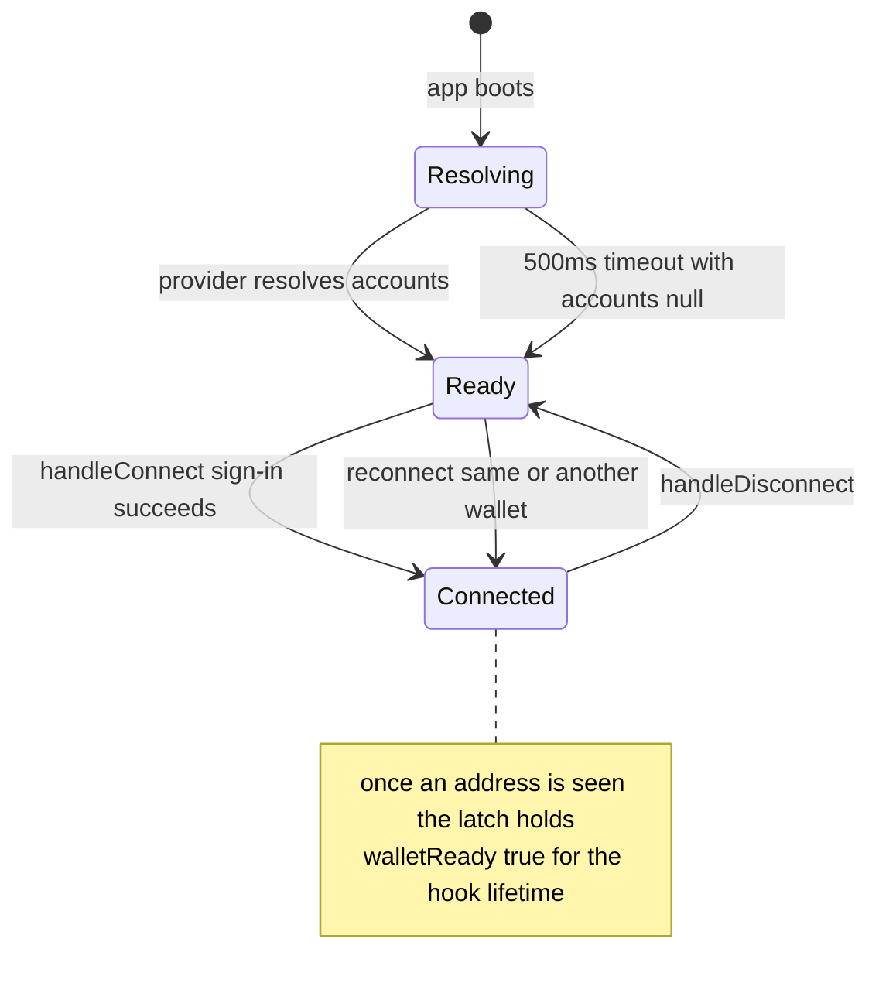

# App Boot & Wallet Lifecycle

This page follows one run of the app from process start to a usable positions
screen: the three boot steps that execute outside any React tree, the root
layout's provider stack, and the wallet lifecycle hook that everything
downstream — data loading, widgets, alerts, metrics — keys on. The data path
itself is covered by the [System Overview](/openwiki/architecture/overview.md)
and [Position Data Pipeline](/openwiki/architecture/data-pipeline.md); the
storage these steps write is detailed in
[State & Persistence](/openwiki/architecture/state-and-persistence.md).

## Boot sequence outside the React tree

The entrypoint is `index.js` (wired up by `"main"` in `package.json`), and it
does exactly three things in a load-bearing order:

1. `import './polyfill'` — applies the React Native / Solana compatibility
   patches **before any SDK module evaluates**. On native this is
   `polyfill.js`; on web Metro resolves `polyfill.web.js` instead.
2. `import 'expo-router/entry'` — hands over to file-based routing, which
   mounts `src/app/_layout.tsx` as the root layout.
3. `registerWidgetTask()` — registers the Android widget task handler at
   process start, in the same breath as the polyfill import and before any
   screen mounts, so headless widget clicks (`REFRESH`, `NEXT_POSITION`,
   `PREVIOUS_POSITION`, add/remove) are served even if the app UI never opens.
   The registration lives behind the `src/widgets/registerWidgetTask` seam —
   `registerWidgetTask.web.ts` is a no-op because `react-native-android-widget`
   is native-only.

The polyfill is the reason the order matters. `polyfill.js` patches the Hermes
globals that the two Solana SDK generations, Anchor, and the DLMM SDK assume:
`react-native-get-random-values`, the URL polyfill, a `@craftzdog/react-native-buffer`
`Buffer` with fixed `subarray`/`slice`, 29 Buffer read/write/copy/fill methods
plus `equals` injected onto `Uint8Array.prototype`, and `react-native-quick-crypto`'s
`install()` last. Because the import precedes `expo-router/entry`, every SDK
module — evaluated later as the router's import graph fans out — sees the
patched globals. `polyfill.web.js` only installs `Buffer`; browsers already
provide crypto and URL. The patches themselves are documented on
[Platform Seams & Polyfills](/openwiki/concepts/platform-seams.md).

## Root layout and provider stack

`src/app/_layout.tsx` does its setup in two places:

- **Module scope, before any screen mounts.** `Observe.configure({
integrations: { 'expo-router': true } })` runs when the module is imported —
  toggling the integration later throws — and `createSolanaMainnet({ url:
env.rpcUrl || '' })` plus the app identity (`name: 'Yonks'`, repo URI, icon)
  are built once. The default export is wrapped in `ObserveRoot.wrap`, which
  measures Time to First Render around the root layout. Observe is reached only
  through the `src/observe` seam; the web sibling is a no-op.
- **Inside `RootLayout`.** A `useEffect` mirrors the `settingsStore` theme into
  Uniwind (`Uniwind.setTheme(theme)`), making the persisted store the single
  source of truth for dark/light, and `useWidgetSync()` mounts the foreground
  orchestration that keeps home-screen widgets fresh.

The provider stack is `GestureHandlerRootView → PixelFontProvider →
MobileWalletProvider → Slot`. `MobileWalletProvider` (with the cluster and
identity) comes from the `src/wallet/walletKit` seam — a thin re-export of
`@wallet-ui/react-native-kit`'s `MobileWalletProvider`, `createSolanaMainnet`,
and `useMobileWallet`. App code never imports the package directly; Metro
resolves `walletKit.web.tsx` on web, whose inert provider renders children
unchanged and whose `signIn` throws, because the web target always runs in dev
mock mode and never needs a Mobile Wallet Adapter session.



_Boot and wallet resolution: polyfills land before the SDK graph evaluates, the
widget task handler registers at process start, and the home-screen hook turns
provider resolution into a ready signal — either a real account or the 500ms
timeout._

## Wallet resolution: the `walletReady` latch

`useWalletLifecycle` is the single place the UI touches wallet state. It reads
`account`, `accounts`, `disconnect`, and `signIn` from `useMobileWallet()` and
exposes `{ walletReady, walletAddress, isConnecting, handleConnect,
handleDisconnect }`.

The provider's `accounts` is `null` while the kit has no resolved
authorization and becomes the array of authorized accounts once one exists —
it loads from the provider's persisted cache at mount and updates after
sign-in. Resolution is async and can be slow or never arrive, so the hook adds
a bounded fallback:

```ts
const WALLET_TIMEOUT_MS = 500
...
const walletReady = accounts !== null || walletCheckTimedOut
```

A `setTimeout` re-armed on every `accounts` change sets `walletCheckTimedOut`
after 500ms — but only if `accounts === null` at that moment. A
resolved-but-disconnected provider (`accounts: []`) is therefore ready
immediately, with no timeout in play.

The latch is what makes the signal stable for the rest of the session. A second
effect watches `account?.address`; the first time a valid address appears it:

1. sets `walletCheckTimedOut` to `true` — and nothing in the hook ever sets it
   back to `false`,
2. persists the address with `setStoredWalletAddress(account.address)` for
   headless widget access, and
3. clears the pending timeout.

This matters because disconnect returns the provider's `accounts` to `null`
(the kit deauthorizes and clears its cached authorization). Without the latch,
`walletReady` would flip back to false after a disconnect and the header would
revert to the unresolved "..." skeleton. With it, once a real account has been
seen, `walletReady` stays `true` for the hook's lifetime regardless of
subsequent connect/disconnect churn.



_Wallet resolution states: `walletReady` is false only in `Resolving`; both the
timeout and a resolved provider reach `Ready`, and the latch prevents any
return trip._

Under `env.devMock` — which is always true on web and opted into on native via
`EXPO_PUBLIC_DEV_MOCK=1` — the hook short-circuits before reading any wallet
value: it returns `walletReady: true`, `walletAddress` toggling between
`MOCK_WALLET_ADDRESS` and `undefined`, and connect/disconnect handlers that
flip local state only. No Mobile Wallet Adapter machinery runs.

## Connect: sign-in over Mobile Wallet Adapter

`handleConnect` drives the `signIn` flow:

```ts
await signIn({
  domain: 'yonksdotsol.app',
  statement: 'Sign in to access your DLMM positions',
  version: '1',
})
```

The kit's `signIn` wraps a Mobile Wallet Adapter `transact` session whose
`authorize` call carries this SIWE-style payload (domain, statement, version)
alongside the cluster and app identity. On success the authorization —
accounts, auth token, selected account — is persisted by the provider, making
`accounts` non-null; the latch effect then fires and the address lands in MMKV.

Both outcomes are instrumented with an Observe `wallet.connect` event carrying
`success` and `durationMs`; the failure path logs at `warn` severity. Failure
handling is deliberate: after logging, `handleConnect` calls
`await disconnect().catch(() => {})` so a rejected, timed-out, or
partially-authorized session never survives as a half-connected state — the
provider's stored authorization is cleared either way. `isConnecting` is held
`true` for the whole attempt and gates the wallet button (`disabled={isConnecting}`).

## Disconnect: clear the address and the alert baseline

`handleDisconnect` reads the stored address **before** disconnecting, awaits
the kit's `disconnect` (deauthorize + cache clear), and logs an Observe
`wallet.disconnect` event with `hadStoredAddress`. Only when an address was
actually stored does it clean up persistence:

- `setStoredWalletAddress(undefined)` — removes `wallet_address` from the
  `wallet` MMKV instance (and bumps the revision, below), which wakes
  `useWidgetSync`'s subscription so widgets redraw their "Connect wallet"
  state immediately.
- `clearRangeState(currentAddress)` — deletes that wallet's entry from the
  `alerts` store, removing the in-range baseline of the last background check.
  Without this, a future session against the same wallet could transition
  against a stale baseline; `alertStore`'s semantics treat an absent baseline
  as a silent "first check" that emits no alerts.

## The persisted wallet address and its revision bump

`setStoredWalletAddress` writes into the dedicated `wallet` MMKV instance
(`createMMKV({ id: 'wallet' })`, keys `wallet_address` and `wallet_revision`)
with two invariants:

1. **No-op on an unchanged address** — the revision only moves on real
   transitions, so a re-render that re-persists the same address is free.
2. **Revision written before the address** — MMKV fires value-changed listeners
   per key; by bumping `wallet_revision` first, any listener woken by the
   subsequent `wallet_address` write or removal reads a complete,
   self-consistent `{ address, revision }` snapshot rather than a new address
   paired with the old session's revision.

Because the revision increments on every connect, switch, _and_ disconnect,
reconnecting the same address is a new session: headless consumers compare the
pair, never the address alone. The `widget-background-sync` task and both
widget sync modules guard their work with `getStoredWalletSnapshot()`
comparisons, and `useWidgetSync` subscribes via
`subscribeStoredWalletAddress` to redraw immediately on any transition,
bypassing its normal foreground debounce. The regression suite pins this
down — a request started before a disconnect must be rejected even when the
same wallet reconnects, and reconnecting must not resurrect the previous
session's cached widget snapshots. The full write-path mechanics live in
[State & Persistence](/openwiki/architecture/state-and-persistence.md).

## Data handoff on the home screen

The home screen (`src/app/index.tsx`) binds the lifecycle to the UI and the
data layer:

- **Connection affordances.** The header shows `...` while resolving,
  `Not Connected` once ready without an address, and the truncated
  `first4...last4` address when connected. The wallet button toggles
  `handleConnect`/`handleDisconnect`, dimmed and disabled while
  `isConnecting`.
- **Wallet-change data handoff.** `usePositionsPage(walletAddress,
walletReady)` invalidates the previous wallet's pipeline cache on an address
  change, resets `loading`/`tokenDataReady`/result, and loads the new
  portfolio plus the SOL price; a transition to _no_ address clears results,
  loading, and the price instead.
- **Empty-state resolution.** A ready wallet with no address is terminal and
  needs no fetch: the effect sets `loading: false` and `tokenDataReady: true`
  so the empty state renders. After a real load, `tokenDataReady` becomes true
  only when there are zero positions or at least one position has token info —
  preventing a blank first frame of the list.
- **TTI marking.** The home screen calls `markInteractive()` exactly when
  `walletReady && tokenDataReady` — the Observe Time-to-Interactive signal
  that real content or the empty state is on screen. Calling it repeatedly is
  safe; only the first call counts. On web the whole seam is a no-op.

## Testing the lifecycle

The lifecycle's persistence contract is exercised at the store and widget
layers, not by mounting the hook: `src/__tests__/widgets/portfolioWidgetSync.test.tsx`
mocks `createMMKV` with per-instance `Map`s (including value-changed listeners)
and drives `setStoredWalletAddress` through connect/switch/disconnect/reconnect
sequences, asserting the immediate widget redraws and the
request-from-before-disconnect rejection. `vitest.config.ts` aliases
`expo-observe` to its web stub, so hooks that emit Observe events —
`wallet.connect` included — stay importable in the Node test environment.
For manual checks, `bun run web` boots straight into dev mock mode where the
wallet toggle exercises connected/empty states without a device.
