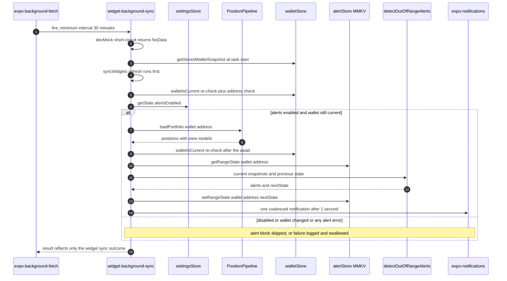

# Out-of-Range Alerts

Yonks notifies the user when a DLMM position stops earning fees — that is, when
it transitions **in-range → out-of-range**. The feature is deliberately split
into three small pieces:

- **A pure detector**, `detectOutOfRangeAlerts` in
  `src/utils/alerts/outOfRange.ts`, that compares current position states
  against the previous snapshot and emits one alert per transition. It does no
  I/O and touches no stores.
- **Per-wallet state** in `alertStore`, a dedicated MMKV instance, holding the
  in-range baseline from the last background check.
- **A thin sender** and one call site: `sendOutOfRangeNotifications` wraps
  expo-notifications and swallows its own errors, and the only place alerts are
  produced is inside the `widget-background-sync` background task
  (`src/tasks/widgetBackgroundSync.ts`), gated on the user's
  `alertsEnabled` setting.

The detector's two rules carry the feature's whole safety story: **only a
transition alerts** (states never do), and **a first-ever check never alerts**
— which is what prevents a notification storm on install or on connecting a
wallet that already has out-of-range positions.

_One background run: widget sync first, then the alert check as a fully
contained best-effort block whose failures and wallet-session aborts can never
change the task's result code._

## A pure detector and a thin sender

`src/utils/alerts/outOfRange.ts` exports exactly two functions, and the
pure/side-effect boundary between them is the module's design point.

### `detectOutOfRangeAlerts`: transitions, not states

The detector takes the current snapshots — one `{ id, inRange }` per position —
and the previous `Record<string, boolean> | null`, and returns
`{ alerts, nextState }`. A position alerts **only** when the previous snapshot
says it was in range and the current one says it is not:

| previous state       | current `inRange` | alert?               |
| -------------------- | ----------------- | -------------------- |
| `null` (first check) | anything          | **no — record only** |
| `true`               | `false`           | **yes**              |
| `true`               | `true`            | no                   |
| `false`              | `false`           | no (already out)     |
| `false`              | `true`            | no (recovery)        |
| absent from previous | `false`           | no (brand-new)       |

Three consequences matter:

- **The no-first-check-storm rule.** `previous === null` — a wallet never seen
  before, or a corrupt store read (see below) — means the run records state and
  emits nothing. Installing the app, or connecting a wallet that already has
  out-of-range positions, produces silence, then a baseline. Only _subsequent_
  changes notify.
- **Brand-new positions never alert.** A position absent from `previous` is
  recorded as its current state but cannot transition into an alert; a position
  reappearing after being closed and reopened is brand-new again.
- **`nextState` records exactly the ids present in `current`.** Closed or
  removed positions drop out of the baseline automatically, and the caller
  persists `nextState` even when alerts were suppressed, so the baseline always
  mirrors the wallet's current portfolio.

Because the function is pure, the entire transition matrix is pinned by a
focused unit test with the notification SDK merely mocked (see below).

### `sendOutOfRangeNotifications`: one coalesced, best-effort notification

The sender is the feature's only side-effecting function. Given the detector's
alerts it:

1. no-ops when the list is empty;
2. ensures the Android notification channel `out-of-range` exists ("Out of
   range", importance `HIGH`);
3. schedules **a single** local notification for the whole batch — title
   "Position out of range" or "`N` positions out of range", body "Your position
   is no longer earning fees. Tap to view in Yonks.", deep-link data
   `{ screen: 'positions' }`, and a 1-second `TIME_INTERVAL` trigger on the
   channel.

Despite the doc comment's "one local notification per alert" phrasing, the
implementation always coalesces into one notification whose title carries the
count. The entire body is wrapped in a `try`/`catch` that logs and swallows: a
notification error is never allowed to propagate to its caller, the background
task.

## State: alertStore's per-wallet baselines

`src/stores/alertStore.ts` owns a dedicated MMKV instance created with
`createMMKV({ id: 'alerts' })` and stores everything under a **single key**,
`out_of_range_state`: one JSON record mapping wallet address →
`RangeStateMap`, where `RangeStateMap = Record<positionId, boolean>` is the
in-range state as of the last background check. Per-wallet namespacing inside
one record means the task always reads and writes the baseline of exactly the
wallet it is working on.

The read/write/clear trio has deliberate corruption semantics:

- `getRangeState(walletAddress)` returns `null` for a wallet it has never seen
  **or** when the stored record fails to parse. `null` flows into the detector
  as "first check", so a corrupt baseline degrades to a harmless record-only
  run rather than a false storm.
- `setRangeState(walletAddress, state)` is a read-modify-write of the single
  record. Unlike the other two, it does not guard its `JSON.parse` — a corrupt
  record would throw into the background task's alert `try`/`catch` (logged,
  swallowed, baseline not updated) rather than crash anything.
- `clearRangeState(walletAddress)` deletes just that wallet's entry; if the
  record cannot be parsed at all, it wipes the whole key so corrupt storage
  never survives to poison a later comparison.

Because the store is plain functions over MMKV (no React, no Zustand), the
headless background task uses the identical code path as the UI — the same
pattern as `walletStore` (see
[State & Persistence](/openwiki/architecture/state-and-persistence.md)).

## The background task: `widget-background-sync`

Alerts ride inside the existing background widget-sync task rather than
defining a second expo-task. The task is defined with `defineTask('widget-background-sync')`
and registered idempotently — guarded by `isTaskRegisteredAsync` — from
`useWidgetSync` on mount (native only; the `.web.ts` stub is a no-op), with
`minimumInterval: 1800` (30 minutes), `stopOnTerminate: false`, and
`startOnBoot: true`. An idempotent `unregisterWidgetBackgroundSync` exists for
symmetry but has no production caller.

Each run:

1. **Short-circuits in dev mock.** `env.devMock` (the `EXPO_PUBLIC_DEV_MOCK`
   flag, or web, where it is always on) returns `NoData` before any work — no
   sync, no alerts.
2. **Syncs widgets first.** `syncWidgets()` refreshes the home-screen widgets;
   the alert check piggybacks on that run.
3. **Verifies the wallet twice** (next section).
4. **Gates on the setting**, then detects, records, and notifies (the section
   above).

### The `walletIsCurrent` re-checks

The task captures `getStoredWalletSnapshot()` once at start and defines
`walletIsCurrent()` as a comparison of **both address and revision** against a
fresh read — the same pair-based session test the widget syncs use. The
revision counter increments on every connect, switch, _and_ disconnect, so
reconnecting the same address is a new session. `walletIsCurrent()` is checked:

- **after `syncWidgets`** (together with the no-address check): if the wallet
  disappeared mid-run, the task returns `NoData` immediately; and
- **again after the awaited `loadPortfolio`**: loading a portfolio is the one
  slow async step, so a wallet switch, disconnect, or same-address reconnect
  that happens while it is in flight aborts the run **before** any state is
  read, recorded, or alerted.

The result: a run can never write `nextState` into wallet A's baseline while
wallet B is active, and never alerts the wrong wallet or a stale session of the
right one.

### Failure isolation, twice over

Alerts can fail in two places and both are contained:

- `sendOutOfRangeNotifications` swallows its own notification errors.
- The **entire alert block** — the gate read, `loadPortfolio`, the store reads
  and writes, and the send — runs in its own `try`/`catch` that logs
  `widgetBackgroundSync: alert check failed` and moves on.

The task's `BackgroundFetchResult` therefore reflects **only the widget sync
outcome**: `NewData` when the sync reported `'updated'`, `NoData` when it
reported `'no-data'`, `Failed` only when the sync threw or returned
`'failed'`. This matters operationally: expo-background-fetch uses the result
code for OS scheduling decisions, so a flaky notification or RPC failure can
never get the task throttled or killed.

## The `alertsEnabled` gate and the disconnect lifecycle

- **Default off, persisted.** `alertsEnabled` lives in `settingsStore`
  (Zustand + persist over the `settings` MMKV instance) and defaults to
  `false`. The background task reads it headlessly via
  `useSettingsStore.getState().alertsEnabled` — no React required.
- **Permission-guarded toggle.** The "Out-of-range alerts" switch in
  `SettingsSheet` requests OS notification permission _before_ enabling; if
  permission is denied it shows an inline hint and forces the flag back to
  `false`. So an enabled flag implies permission was granted at toggle time
  (the OS can still revoke it later — delivery remains best-effort).
- **Disconnect clears the baseline.** `useWalletLifecycle`'s
  `handleDisconnect` captures the stored address _before_ awaiting
  `disconnect()`, then calls `setStoredWalletAddress(undefined)` followed by
  `clearRangeState(currentAddress)`. The wallet's baseline is deleted, so a
  future session — even a reconnect of the same address — finds no previous
  state and starts record-only, exactly as if the wallet were new.

## Invariants and failure semantics

- `detectOutOfRangeAlerts` is pure: no I/O, no store access, fully table-testable.
- A first-ever check (`previous === null`) records state and emits nothing —
  no notification storm on install or new-wallet connect.
- Only `true → false` transitions alert; already-out, brand-new, and recovered
  positions stay silent; at most one alert per position per run, coalesced
  into a single notification.
- `nextState` is persisted before the notification await: a delivery failure
  loses that alert (best-effort) rather than re-alerting on the next run.
- `walletIsCurrent()` (address **and** revision) is re-checked after the widget
  sync and again after the portfolio load; any mismatch aborts with `NoData`
  and no state write — never an alert for the wrong wallet or session.
- The alert block's own `try`/`catch` plus the sender's internal one mean
  notification, RPC, or store failures never fail the background task or
  change its `BackgroundFetchResult`.
- Corrupt stored state degrades safely: `getRangeState` yields `null`
  (record-only run), `clearRangeState` wipes the key; `setRangeState`'s
  unguarded parse throws only into the task's containment catch.
- Dev mock mode (and web, where it is always on) never syncs and never alerts.

## Configuration and operations

- **User-facing switch:** `alertsEnabled` in the Settings sheet, default
  `false`, persisted in the `settings` MMKV instance under the persist key
  `settings-store`.
- **Cadence:** `minimumInterval: 1800` seconds in the registration options;
  the task also runs `startOnBoot` and survives termination
  (`stopOnTerminate: false`). Actual firing frequency is at the OS's mercy —
  which is why detection is transition-based against stored state, not
  wall-clock based.
- **Notification identity:** channel id `out-of-range`, name "Out of range",
  importance `HIGH`, tap data `{ screen: 'positions' }`.
- **Extension shape:** another transition-based alert would reuse the same
  four pieces — a pure detector, a thin sender that swallows its own errors, a
  per-wallet MMKV baseline, and a gate from `settingsStore` inside the task's
  contained alert block.

## Focused tests that matter

`src/__tests__/utils/outOfRange.test.ts` pins the detector's complete contract
with expo-notifications mocked but unasserted — the tests target the pure
function:

- first-ever check (`previous === null`) emits no alerts and records state;
- an in-range → out-of-range transition alerts;
- a position that was already out stays silent;
- a brand-new position absent from `previous` never alerts (and is recorded);
- recovery to in-range never alerts;
- multiple simultaneous transitions each produce an alert.

The delivery half is intentionally untested as a unit — it is a thin
try/except wrapper around expo-notifications whose contract ("never throw")
is enforced by construction.

## Related pages

- `/openwiki/architecture/state-and-persistence.md` — the `alerts` MMKV
  instance, the wallet revision counter, and why `alertStore` is plain
  functions over MMKV
- `/openwiki/architecture/data-pipeline.md` — `PositionPipeline.loadPortfolio`,
  whose view models supply `inRange`
- `/openwiki/workflows/widget-sync.md` — the widget sync half of the same
  background task
- `/openwiki/workflows/app-boot-and-wallet.md` — connect/disconnect lifecycle
  that drives `clearRangeState`
