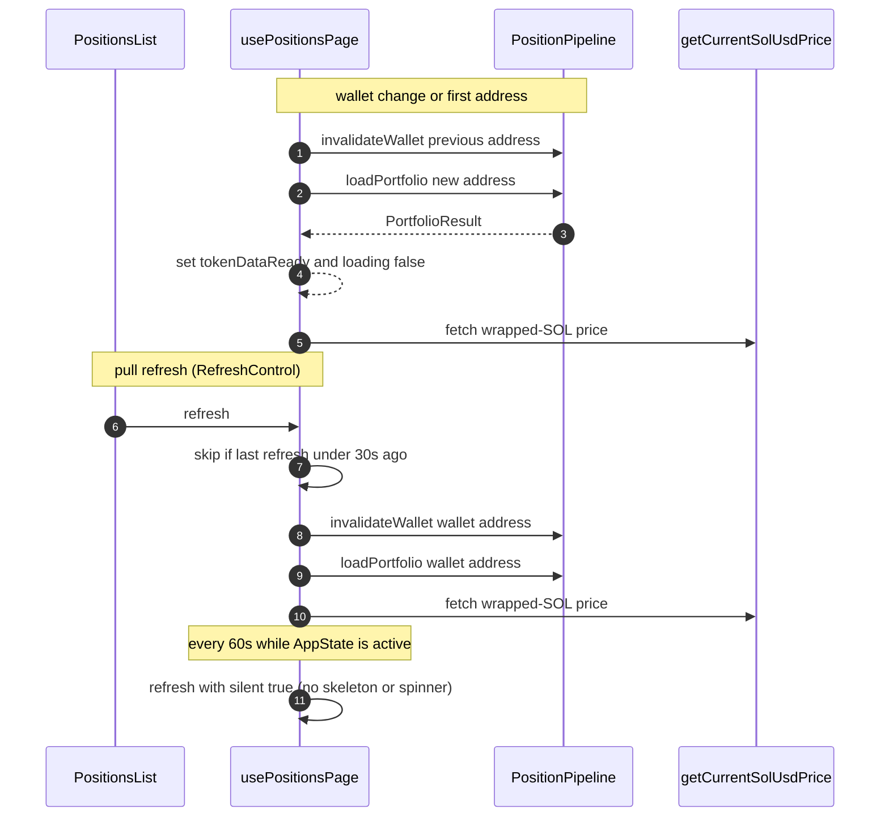
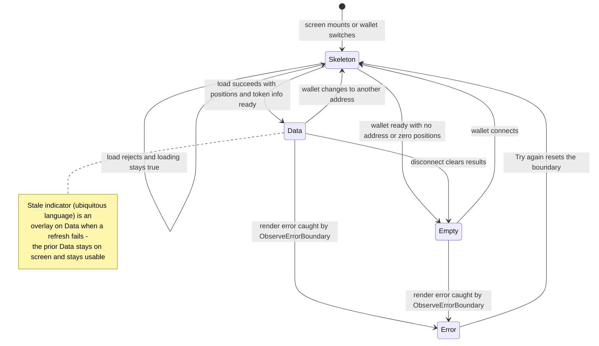

# Positions Screen Data Flow

The positions screen is a single route whose entire data life is owned by one
hook. `src/app/index.tsx` — the home route — binds the wallet lifecycle to
`usePositionsPage`, and `PositionsList` (the default export of
`src/app/positions/index.tsx`) turns the hook's result into one of four
mutually exclusive UI states. The hook owns the orchestration that makes the
screen feel alive without user effort: it invalidates and reloads on wallet
change, throttles manual refreshes to one per 30 s, and silently re-fetches
every 60 s while the app is foregrounded. The data itself comes from the
`PositionPipeline` documented on [Position Data Pipeline](/openwiki/architecture/data-pipeline.md);
this page is about what the screen does around it.

## Screen orchestration

`src/app/index.tsx` wires three collaborators:

- `useWalletLifecycle()` supplies `walletReady` and `walletAddress` (see
  [App Boot & Wallet Lifecycle](/openwiki/workflows/app-boot-and-wallet.md)).
- `usePositionsPage(walletAddress, walletReady)` owns all positions data,
  loading flags, the SOL price, and the `refresh` handler.
- `PositionsList` renders the result, wrapped in an `ObserveErrorBoundary`
  whose fallback is `PositionsErrorState` — a full-screen recovery UI whose
  **Try again** button resets the boundary and re-mounts the list. The
  boundary records render-phase errors as EAS Observe `exception` events; the
  web stub of the Observe seam is a passthrough.

The header (connection state, settings, theme, wallet button) and the dev-mock
banner live above this and are irrelevant to the data flow except that the
wallet button is what triggers the wallet-change lifecycle below.

## The `usePositionsPage` contract

`PositionsPageResult` (`src/hooks/usePositionsPage.ts`) is the screen's entire
data API:

| Field                                                                                     | Meaning                                                                                                               |
| ----------------------------------------------------------------------------------------- | --------------------------------------------------------------------------------------------------------------------- |
| `positions`, `summary`, `hasPnLData`, `outOfRangeCount`, `poolAddresses`, `positionCount` | A `PortfolioResult` from the pipeline, flattened to safe defaults (`[]`, `null`, `0`) before the first load completes |
| `loading`                                                                                 | True during a skeleton-visible load (initial load or pull refresh)                                                    |
| `tokenDataReady`                                                                          | True when token prices have resolved — the list-frame gate (below)                                                    |
| `solUsdPrice`                                                                             | Live SOL→USD rate for the display toggle; `null` while loading or on failure                                          |
| `refresh(options?)`                                                                       | Manual/automatic reload; `silent: true` skips skeleton and spinner                                                    |
| `walletReady`, `walletAddress`                                                            | Passed through from the lifecycle                                                                                     |

The hook runs three triggers — wallet change, throttled refresh, and the
foreground timer — all converging on the same two calls: `pipeline.loadPortfolio`
and `getCurrentSolUsdPrice`.

_The three refresh triggers converge on `invalidateWallet` + `loadPortfolio` +
a SOL-price fetch. Only an executed pull makes loading visible; a pull inside
the 30 s cooldown is swallowed before any spinner appears, and the silent path
never shows one at all._

## Trigger 1 — wallet change: invalidate, clear, reload

The wallet-change effect fires on every `walletAddress` transition:

1. **Invalidate.** The previous wallet's cache entries are dropped via
   `pipeline.invalidateWallet(prevAddress)`, which is
   `cache.invalidatePattern(":{walletAddress}")` — suffix-scoped, so PnL keys
   (which end with the wallet) are evicted while shared `token_data:*` prices
   survive their 60 s TTL. Disconnect is a transition to _no_ address and hits
   the same invalidation before clearing.
2. **Reset.** `tokenDataReady` goes `false`, `loading` goes `true`, and
   `result` goes `null` — this is what returns the screen to the Skeleton
   state when switching wallets.
3. **Reload.** `pipeline.loadPortfolio(currentAddress)` resolves into
   `setResult`, clears `loading`, and sets `tokenDataReady`. In parallel
   `getCurrentSolUsdPrice()` fills `solUsdPrice` (or `null` on failure).
4. **Disconnect.** When the address becomes `null`, the hook instead clears
   `result`, `loading`, and `solUsdPrice` without fetching — the screen falls
   to the Empty state because `walletReady` latched `true` in the lifecycle
   hook and never flips back.

A complementary effect handles the terminal "ready but no address" case
(provider resolved, timeout elapsed, no wallet): it sets `loading: false` and
`tokenDataReady: true` directly, so the Empty state renders with no fetch at
all.

## Trigger 2 — throttled pull refresh (30 s)

`refresh(options?)` is the `RefreshControl` handler on both the list and the
empty-state scroll view. Its guard rails:

- **No-op conditions.** Returns immediately in dev mock mode (`env.devMock`)
  and when there is no `walletAddress`.
- **30 s cooldown.** `now - lastRefreshRef.current < 30_000` returns early —
  the throttled call does not set `loading`, so a suppressed pull never even
  starts the native spinner. Every _executed_ refresh (pull or auto) updates
  the timestamp, so the two triggers share one budget.
- **Invalidate then reload.** `pipeline.invalidateWallet(walletAddress)` runs
  before `loadPortfolio`, so PnL figures re-fetch rather than replay from the
  15-minute `pnl:*` cache.
- **Observability.** Completion logs the Observe event `positions.refreshed`
  with `durationMs`, `positionCount`, and `source` — `'pull'` for manual
  refreshes, `'auto'` for silent ones.

The visibility difference is the point:

- **Pull refresh** (`silent` unset) sets `loading: true`, which shows the
  native `RefreshControl` spinner. The skeleton does _not_ appear for a
  non-empty list — `tokenDataReady` stays `true` and
  `positions.length === 0` is false — so existing cards stay mounted while
  the spinner runs.
- **Silent refresh** (`silent: true`) never touches `loading`. The current
  data stays on screen — no skeleton, no spinner — and the numbers simply
  update in place when the fetch resolves.

## Trigger 3 — silent auto-refresh (60 s, foregrounded)

`AUTO_REFRESH_INTERVAL_MS = 60_000` arms a `setInterval` that calls
`refresh({ silent: true })` **only when `AppState.currentState === 'active'`**,
so backgrounded apps neither burn RPC calls nor wake to a stale screen. The
effect is skipped entirely in dev mock and re-arms whenever `walletAddress`
(or the `refresh` callback identity) changes, tearing down the old interval on
unmount. Because the interval period (60 s) exceeds the throttle (30 s), a
quiet session lets every tick through; a manual pull within the last 30 s
swallows the next tick instead of double-fetching.

## `tokenDataReady` gating: no blank list frame

Positions and their token metadata resolve in the same pipeline pass, but a
position can legitimately have `tokenXInfo: null` while its card is already
listable (per-mint token fetches fail independently). Rendering the list the
moment `positions` arrives can therefore flash a `LegendList` frame of
skeleton-cards-with-no-symbols. The gate closes that window:

- On every successful load, the hook sets
  `tokenDataReady = positions.length === 0 || positions.some((p) => p.tokenXInfo !== null)`
  — true immediately for empty wallets, otherwise only once at least one
  position carries resolved token info.
- `PositionsList` computes
  `showSkeleton = !walletReady || !tokenDataReady || (positions.length === 0 && loading)`,
  so the screen-level skeleton (summary + card placeholders) holds until the
  wallet is resolved, the fetch is complete, **and** token data is ready.

Individual cards keep their own inner skeleton
(`PositionCard` renders `PositionCardSkeleton` when _both_ token infos are
still null) as a per-row fallback for positions whose mints failed while
another position's succeeded.

## The four screen states and the stale overlay

`UBIQUITOUS_LANGUAGE.md` fixes the contract: the screen is in exactly one of
four states at once — **Skeleton** (loading), **Empty state** (resolved, no
positions), **Error state** (render failure), or **Data** (positions
rendered) — and a **Stale state** indicator can additionally overlay Data when
a refresh fails, never replacing the data.

_The four mutually exclusive screen states. Skeleton, Empty, and Data are
computed from `walletReady` / `tokenDataReady` / `loading` / `positions`; the
Error state is exclusively the error-boundary fallback, and Stale is defined
as an overlay on Data._

Two implementation details deserve care when reasoning about failures:

- **The Error state is render-phase only.** It is reached through
  `ObserveErrorBoundary`, not through data-fetch rejection. `loadPortfolio`
  rejections have no `.catch` in the hook: a failed initial load leaves
  `loading` true and the Skeleton up, and a failed refresh leaves the prior
  result rendered (a pull refresh keeps its spinner; a silent refresh just
  keeps the old numbers). The stale-overlay idea — "prior Data stays on screen
  and remains usable" — is what the silent path already does in practice;
  there is no dedicated stale-banner component in `src/` today.
- **Empty is stateful, not dead.** The empty screen still carries a
  `RefreshControl`, so a wallet that later acquires positions is one
  (throttled) pull away from Data. And while a wallet address is present the
  60 s auto-refresh keeps running behind the empty screen too — a connected
  wallet with zero positions needs no interaction to fill in.

Inside Data there is one secondary loading surface: when positions exist but
PnL data has not arrived (`positionCount > 0 && !hasPnLData`),
`PortfolioSummary` renders its own `PortfolioSummarySkeleton` in place of the
hero; with no positions it renders nothing. When `outOfRangeCount > 0` the
list header adds the "{count} position(s) out of range" banner above the
cards.

## The SOL/USD toggle and the wrapped-SOL price

`solUsdPrice` is fetched by `getCurrentSolUsdPrice()`, which asks the shared
token service for the **wrapped-SOL mint** (`So11111111111111111111111111111111111111112`)
— SOL's own price is just another `TokenInfo`, served from the
`CacheManager`-backed `token_data:{mint}` entry with its 60 s TTL, so repeated
refreshes are cheap. The function returns `price_info.price_per_token` when it
is a finite number and `null` on any failure. In dev mock the price is seeded
synchronously with `MOCK_SOL_USD_PRICE` (145.0) — no RPC on web.

The rate feeds the **SOL/USD display toggle**, hosted by `PortfolioSummary` as
a `SegmentedControl` bound to the persisted `settingsStore.displayCurrency`
(default `'SOL'`). All aggregated figures are SOL-native; USD is a
presentation-time lens:

- **SOL mode** delegates to the pixel-font `SolValue` renderer, unchanged.
- **USD mode** renders `formatUsdFromSol(sol, solUsdPrice)`; a missing price
  degrades to `$0.00` rather than `NaN`.

The price threads from the hook through `PositionsList` into the summary and
every `PositionCard`, where `PositionHeader` converts the uPnL line as
`upnlValue * solUsdPrice` in USD mode and falls back to the SOL rendering when
the price is null. Card USD _value_ strings baked into the view model are
independent of this toggle — they are computed from each token's own price at
pipeline time.

## Mock parity: the screen never sees raw `PositionInfo`

`PositionsList` maps each `ResolvedPosition` to a `PositionCard` carrying only
`vm`, `tokenXInfo`, `tokenYInfo`, and `solUsdPrice`; `PortfolioSummary`
consumes only the summary fields. Nothing in the UI layer reads the raw
on-chain `PositionInfo` object. That boundary is what lets dev mock mode drive
the **identical render path**: `mockPortfolio` builds a real-shaped
`PortfolioResult` and stubs the unusable field with `position: {} as
PositionInfo`, and the screen cannot tell the difference.

Under `env.devMock` (always true on web; `EXPO_PUBLIC_DEV_MOCK=1` on native)
the hook bypasses the pipeline entirely: it returns the static portfolio with
`loading: false` and `tokenDataReady: true`, `refresh` is a no-op, and — when
the mock wallet is "disconnected" — it returns empty data with
`tokenDataReady: true` so the Empty state can be exercised in the browser.

## Observability: TTI and refresh events

The home screen marks Observe **Time-to-Interactive** exactly when
`walletReady && tokenDataReady` — the moment real content or the empty state
is genuinely on screen. Repeated calls are safe; only the first counts, and
the whole seam is a no-op on web. Every executed refresh adds a
`positions.refreshed` event with `durationMs`, `positionCount`, and the
pull/auto `source`, which is how the 30 s throttle's effectiveness and the
silent path's cost are monitored in production.

## Where behavior is pinned

The hook itself has no dedicated test file; its behavioral guarantees live one
layer down and beside it — `src/__tests__/services/positionPipeline.test.ts`
pins the `loadPortfolio` contract the hook depends on (empty wallet,
invalidation scoping, token-price failure degradation), and the formatters
tests pin the `$0.00` / em-dash placeholder semantics the USD lens relies on.
`bun run web` boots straight into dev mock mode, where the wallet toggle
exercises the connected/Empty transition without a device.

## Related pages

- `/openwiki/architecture/data-pipeline.md` — the `loadPortfolio` steps, error degradation, and cache keys this screen orchestrates
- `/openwiki/workflows/app-boot-and-wallet.md` — how `walletReady`/`walletAddress` are produced and latched
- `/openwiki/concepts/domain-model.md` — the state vocabulary, uPnL naming, and the display-currency rules
- `/openwiki/concepts/theming-and-design.md` — the skeleton, segmented control, and token styling the states render through
