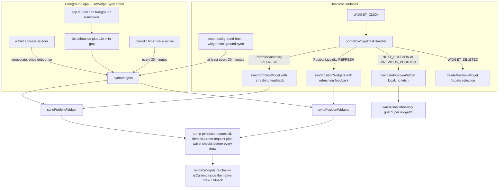
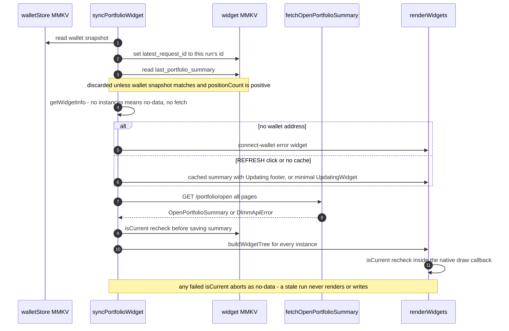

# Android Widget Sync

Yonks ships two Android home-screen widgets, declared in `app.json` under the
`react-native-android-widget` plugin: **`PortfolioSummary`** ("Yonks
Portfolio") and **`PositionLiquidity`** ("Yonks Positions"). Both are rendered
from JavaScript: `react-native-android-widget` converts React element trees
into native Android RemoteViews, so every refresh is a JS run that must fetch
data, persist it, and hand a tree back to Android. The interesting engineering
is not the drawing — it is guaranteeing that a slow, headless, or interleaved
run can never show another wallet's numbers, a closed position, or a result
that a newer run already superseded.

Two coordinators own those guarantees: `syncPortfolioWidget` and
`syncPositionWidgets`, fanned out by `syncWidgets`. Every trigger path —
foreground app activity, the background fetch task, and home-screen clicks —
converges on them.

## Trigger paths

*All refresh triggers converge on the two sync coordinators; only
NEXT/PREVIOUS_POSITION navigation takes the cheap per-widgetId path, and every
render funnel re-checks ownership at the draw boundary.*

### Foreground: `useWidgetSync`

`src/app/_layout.tsx` mounts `useWidgetSync()` once at the root. The effect
(`src/hooks/useWidgetSync.ts`) wires four triggers:

- **Wallet changes are immediate.** `subscribeStoredWalletAddress` fires on
  the wallet MMKV key and calls `updateWidget(true)`, which bypasses both the
  debounce and the 10-second minimum gap — a connect/disconnect/switch must
  clear or redraw the widgets at once.
- **Launch and foreground** transitions (from `background`/`inactive` to
  `active`) schedule an update behind a 3-second debounce
  (`FOREGROUND_DEBOUNCE_MS`), coalescing rapid state flips.
- **A periodic timer** fires every 30 minutes but only acts while
  `AppState.currentState === 'active'`; it is stopped when the app
  backgrounds and restarted on return.
- **Non-wallet updates are rate-limited**: `updateWidget` skips the call if
  the last update is under 10 seconds old, except for wallet changes.

The effect also registers the background task (idempotently — see below) and
cleans up everything on unmount, cancelling a still-pending debounce.

### Headless: background fetch and the task handler

`index.js` calls `registerWidgetTask()` at process start, before any screen
mounts, so headless widget events are served even if the UI never opens. The
registration lives behind the platform seam pair
`src/widgets/registerWidgetTask.ts` / `registerWidgetTask.web.ts` — the web
sibling is a no-op because `react-native-android-widget` is native-only (see
[Platform Seams](/openwiki/concepts/platform-seams.md)).

Two headless surfaces result:

- **`widget-background-sync`** (`src/tasks/widgetBackgroundSync.ts`) is an
  `expo-background-fetch` task registered with `minimumInterval: 1800`
  (30 minutes), `stopOnTerminate: false`, `startOnBoot: true`. Registration is
  guarded by `isTaskRegisteredAsync`, so repeated calls from every
  `useWidgetSync` mount are cheap. Android's own `updatePeriodMillis` is
  likewise set to 1800000 for both widgets in `app.json`.
- **`portfolioWidgetTaskHandler`** routes click and lifecycle actions per
  widget name. For `PositionLiquidity`: `WIDGET_DELETED` forgets that
  instance's selection, `WIDGET_CLICK` with `NEXT_POSITION` /
  `PREVIOUS_POSITION` navigates locally, and anything else (including
  `WIDGET_UPDATE` and a `REFRESH` click) runs `syncPositionWidgets` — with
  refreshing feedback only for the click. For `PortfolioSummary`:
  `WIDGET_DELETED` is ignored and every other action runs
  `syncPortfolioWidget`. Widget bodies are stamped `clickAction="OPEN_APP"`,
  which the library serves natively by opening the app; the handler only acts
  on `REFRESH` and the two navigation actions.

### Result aggregation

`syncWidgets(showRefreshing)` runs both coordinators concurrently and folds
their `WidgetSyncResult` (`'updated' | 'no-data' | 'failed'`): any `'failed'`
wins, otherwise any `'updated'`, otherwise `'no-data'`.

## ADR 0002: the summary widget's numbers come from server totals

ADR 0002 (`docs/adr/0002-widget-summary-from-server-totals.md`) is
**binding** for this
page: the `PortfolioSummary` widget reads the server-aggregated `total` from
the DLMM Data API `GET /portfolio/open` via the in-repo client
(`fetchOpenPortfolioSummary` in `src/services/dlmmApi.ts`). The widget data
path has **no RPC, SDK, or Helius dependency** — it works whenever the DLMM
Data API is reachable. The **in-app** portfolio summary keeps its client-side
aggregation (`computePoolPnLSummary`) because it already needs per-position
data for the cards; the two numeration paths are deliberate, not drift.

`fetchOpenPortfolioSummary` walks every page of `/portfolio/open`
(`page_size` 50 by default, hard limit of 10 pages — exceeding it throws
`DlmmApiError` because an incomplete result is worse than none) and rolls up
the two fields the server does not aggregate: `outOfRangeCount` and the
pool-value-weighted 24h `feesTvl24h`. Per-pool `totalDepositSol` is
deliberately **not** rolled up — it is gross historical deposits and
double-counts redeposits after a withdrawal.

`fetchPortfolioSummary` in `src/widgets/updatePortfolioWidget.tsx` maps the
server snapshot to the widget's `PortfolioSummary`:

- Money fields arrive as strings and are converted with `Number(...)`; null
  server values become `0`.
- **Deposited is derived, never read**: `totalInitialDepositSol =
  totalValueSol - totalPnlSol`, a net cost basis from the server's own
  value/uPnL pair — the same fallback semantic as the in-app
  `computePoolPnLSummary`. A null server PnL collapses deposited to equal
  value.
- `totalCount === 0` returns `null`, which the renderer turns into the
  "No active positions" state — closed positions never resurface from cache.

The position widget, by contrast, *does* use the on-chain pipeline (see
below); the server-totals rule applies to the summary widget only.

## MMKV handoff and the stale-run guard

Widget syncs run in two JS contexts — the app process and headless task
processes — so all coordination state lives in MMKV, not memory. Two dedicated
instances (see [State & Persistence](/openwiki/architecture/state-and-persistence.md))
carry the handoff: `widget` (keys `last_portfolio_summary`,
`latest_request_id`) owned by `syncPortfolioWidget`, and `position-widget`
(keys `positions`, `request`, `loading_request`, `selection:{widgetId}`) owned
by `syncPositionWidgets`.

Both coordinators share one skeleton:

1. Read the wallet snapshot `{ address, revision }` from `walletStore`.
2. Bump the persisted, monotonic request id (`latest_request_id` /
   `request`) **before** doing anything else.
3. Define `isCurrent()` as *persisted id still equals this run's id **and**
   the current wallet snapshot still equals the one captured at start*.
4. Check `isCurrent()` after every await — the widget lookup, the optimistic
   render, the fetch, and before the cache write — and abort as `'no-data'`
   (never rendering, never writing) the moment it fails.

Because the counters live in MMKV, ordering holds across processes and across
headless module reloads: a background run started earlier loses to a manual
refresh started later, and a `vi.resetModules()`-reloaded headless module sees
the same counter (both pinned by tests). `renderWidgets` adds the last line of
defense — after Android's asynchronous widget lookup resolves, it re-checks
`isCurrent()` inside the native `renderWidget` callback and throws a
swallowed `SUPERSEDED` error if ownership was lost, so a wallet change during
the lookup still cancels the draw.

The wallet snapshot is what makes the request id session-safe.
`walletStore` bumps `wallet_revision` **before** writing `wallet_address`,
so every reader sees a complete transition, and unchanged address writes are
no-ops — the revision only moves on real connect/switch/disconnect. A
same-address reconnect is therefore a new session: requests from before the
disconnect are rejected even for the same wallet, and the previous session's
cache is a miss, not a starting point.

### Snapshots are validated on read

Both persisted display snapshots embed the wallet snapshot that produced
them. On read, a mismatched address *or* revision, malformed JSON, or a legacy
snapshot without any wallet identity causes the entry to be **removed** and
treated as a cache miss — a corrupt or foreign-wallet snapshot is discarded,
never shown. A summary with zero positions is likewise removed rather than
stored, so a refreshed-empty wallet cannot resurrect old numbers from cache.

*One summary-widget run: the request id and wallet identity gate every step,
and the draw callback is the final ownership boundary.*

## PortfolioSummary sync states

`syncPortfolioWidget` renders one of five states, updating **all** instances
(since they all display the same wallet):

- **Refreshing with cache** — a `REFRESH` click (or a first sync with no
  cache) immediately draws the last validated summary with the footer
  "Updating…" and the refresh icon in sage; the user's numbers stay visible
  while the fetch runs.
- **Refreshing without cache** — a minimal `UpdatingWidget` ("Updating
  portfolio…"). The cache is never used to show numbers belonging to another
  wallet or a closed portfolio.
- **Data** — `buildWidgetTree(summary)`: hero PnL, total value, out-of-range
  warning row, deposited / unclaimed fees / 24h fees-TVL stats, and the
  updated-at timestamp.
- **Empty** — `null` summary or zero positions renders the "No active
  positions" state.
- **Error / no wallet** — "Failed to load portfolio data" on a current run's
  fetch failure (returned as `'failed'` so the background task can report
  `Failed`), or "Connect wallet in app to see portfolio data" when
  disconnected.

A render or storage failure is caught at the outer boundary, logged, and
returned as `'failed'`; the cached summary is untouched by failed writes
(`saveSummary` swallows its own errors so refresh feedback can still fall
back to the updating state).

## PositionLiquidity: snapshot, selection, and the timeout

`syncPositionWidgets` mirrors the skeleton but adds three position-specific
mechanisms:

- **The pipeline is lazy and conditional.** The fetch dynamically imports
  `createPositionPipeline` and races it against a 20-second deadline
  (`FETCH_TIMEOUT_MS = 20_000`, "Leave time to draw a retry state before the
  30-second headless deadline"). The SDK scan only runs when at least one
  `PositionLiquidity` instance is installed — with none, the coordinator
  returns `'no-data'` before any network or SDK work, and the summary fetch
  is likewise skipped when `PortfolioSummary` has no instances.
- **Refresh-in-progress is persisted.** `loading_request` is set to the
  current request id while a fetch runs and removed on completion or
  failure; `isRefreshing()` compares it against `request`, so any draw (even
  one triggered by an overlapping navigation) renders "Loading positions…"
  without extra coordination.
- **Failure keeps the last good view.** On a timeout or error the coordinator
  clears `loading_request`, draws the existing snapshot with "Could not
  update. Tap Refresh to retry.", and returns `'failed'` — the last graph and
  timestamp survive.

**Selection is per widget instance.** `selection:{widgetId}` stores the
selected position address scoped to the wallet snapshot. `buildPositionTree`
reads both snapshot and selection at draw time (so a navigation tap can
overlap a refresh without losing either), re-persists the drawn selection, and
falls back to index 0 when the selection is missing, foreign-wallet, or points
at a position that has closed.

**Navigation is local and cheap.** `navigatePositionWidget` reads the
snapshot, applies a wrap-around modulo step, persists the selection, and
re-renders only the tapped `widgetId` — no fetch. Its guard checks the wallet
snapshot only (not the request id), deliberately: navigation must not
invalidate an in-flight data refresh. If no positions are cached it falls back
to a full `syncPositionWidgets(true)`. `WIDGET_DELETED` removes just that
instance's selection.

## PositionWidgetData and the liquidity graph

The pipeline's `ResolvedPosition` carries SDK objects — `BigInt` values and
native `PublicKey`s that cannot survive `JSON.stringify`. `toPositionWidgetData`
projects each position to the JSON-only `PositionWidgetData`:
address/pair/symbol strings (symbols fall back to `shortAddress` of the mint),
`inRange`, value and unrealized fees (null when either token price is
missing — never an invented zero), `pnlSol` (null when non-finite), and the
`liquidityShape`. The list is sorted by `positionAddress` so ordering is
stable across refreshes regardless of SDK scan order.

`buildLiquidityGraph` (`src/widgets/liquidityGraph.ts`) renders the bin
distribution as an inline SVG string for an `SvgWidget`:

- **At most 48 grouped bars** (`MAX_BARS`) keep large bin ranges legible at
  home-screen size; bins outside the position's range and non-positive
  amounts are skipped.
- **Peak-bin sampling**: each bar takes the *maximum* bin amount in its
  bucket (`amounts[index] = Math.max(amounts[index], amount)`), so uneven
  bucket sizes cannot manufacture artificial spikes across an otherwise flat
  distribution — a behavior pinned by a dedicated test.
- The active bin is a dashed vertical marker (clamped at the edges), colored
  the primary sage when in range, copper (`secondary`) when the active bin
  sits outside the position's range.
- Degenerate inputs (missing shape, non-finite dimensions, non-safe-integer
  bin counts, non-finite active id) return `null`; the widget then shows
  "Liquidity data unavailable" instead of invalid SVG.

## Render modules: `'use no memo'` and theme tokens

Every widget render module (`updatePortfolioWidget.tsx`,
`syncPositionWidgets.tsx`, `PositionLiquidityWidget.tsx`,
`portfolioWidgetTaskHandler.tsx`) carries the `'use no memo'` directive and
contains no hooks: these components are converted to native RemoteViews in
headless processes where the React runtime, React Compiler memoization, and
hooks are unavailable. Styling reads `themeTokens.dark` directly — pure
constants are headless-task safe, keep the widget on the same source of truth
as the app (a token change in `theme.ts` tracks automatically), and bind dark
explicitly because the widget is dark-only by design and no theme hook exists
headlessly (the app UI routes themes through Uniwind instead — see
[Theming](/openwiki/concepts/theming-and-design.md)).

## Invariants and failure semantics

- Request ids are persisted and monotonic; a stale run loses in both
  directions (older render vs newer, background vs manual) across processes
  and module reloads.
- Wallet identity is compared as address **and** revision together — a
  same-address reconnect cannot accept the previous session's requests or
  cache.
- A snapshot that fails validation is deleted on read, never shown; empty
  results clear the cache rather than storing zeros.
- `isCurrent()` is checked after every await, and once more inside the
  native draw callback; a stale run aborts as `'no-data'` without rendering.
- Navigation never fetches and never invalidates a pending refresh; deletion
  cleans up only the removed instance's selection.
- The background task's result code reflects only the widget sync outcome
  (`NewData`/`NoData`/`Failed`); the out-of-range alert check inside it is a
  best-effort block whose errors are swallowed (see
  [Out-of-Range Alerts](/openwiki/workflows/out-of-range-alerts.md)).
- `devMock` short-circuits every entry point before any network, widget, or
  SDK work: the hook returns immediately, the task returns `NoData`, and both
  coordinators return `'no-data'`.

## Focused tests that matter here

- `src/__tests__/widgets/portfolioWidgetSync.test.tsx` — the cross-process
  contract end to end: cached-numbers refresh feedback, no closed-position or
  foreign-wallet flashes, late-response discard for both success and failure,
  same-address reconnect rejection, draw-time recheck after the native
  lookup, request ordering shared with a `vi.resetModules()` headless load,
  malformed-cache discard, no-instance fetch skipping, and the background
  task's wallet-clearing and lost-race behavior.
- `src/__tests__/widgets/positionLiquidityWidget.test.tsx` — per-instance
  navigation without fetching (including wrapping and persistence across
  module reloads), selection retention across reordered data with fallback
  when a position closes, navigation overlapping a refresh, disconnect/
  reconnect snapshot handling, the 20s timeout drawing a retry state before
  the headless deadline, missing-prices honesty, and the liquidity graph's
  flat-distribution, bar-count, and edge-marker rules plus the JSON-safety of
  `toPositionWidgetData`.
- `src/__tests__/widgets/updatePortfolioWidget.test.ts` — the deposited =
  value − uPnL derivation against a fixed server snapshot, null-PnL
  collapsing deposited to value, and the null return for an empty portfolio.
- `src/__tests__/services/dlmmApi.test.ts` — the `/portfolio/open` client
  contract (pagination rollups, typed `DlmmApiError`) that the widget's
  numeration stands on.

## Related pages

- `/openwiki/architecture/state-and-persistence.md` — the MMKV instances,
  validate-on-read contract, and wallet revision counter these flows consume
- `/openwiki/concepts/platform-seams.md` — `env.devMock` gating and the
  `registerWidgetTask` web no-op pairing
- `/openwiki/integrations/solana-and-meteora.md` — the DLMM Data API client
  and the pipeline the position widget calls
- `/openwiki/architecture/data-pipeline.md` — `PositionPipeline.loadPortfolio`
  behind the position widget's 20-second race
- `/openwiki/workflows/out-of-range-alerts.md` — the best-effort alert block
  inside the background task
- `/openwiki/workflows/app-boot-and-wallet.md` — where `registerWidgetTask`
  and `useWidgetSync` hook into boot
